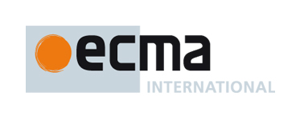

## Agenda for the: 47th meeting of Ecma TC39

    in: Portland, Oregon, USA
    on: 22 - 24, September 2015
    TIME: 10:00 till 17:00 PDT on 22nd and 23rd of September 2015
          10:00 till 16:00 PDT on 24th of September 2015
    LOCATION:
        Tilde Inc
        517 SW 4th Ave, Floor 2
        Portland, OR 97204
    ACCOMMODATIONS:
        Map of walking distance reputable hotels:
        https://www.google.com/maps/d/edit?mid=z77RVuYbTET4.kM1X-SJG-ZM8&usp=sharing
    CONTACT:
        Yehuda Katz <wycats@gmail.com>
        Tilde HQ <events@tilde.io>

  **Please register as soon as possible -- ideally by August 31st if possible!**
  
  [Registration Link](http://doodle.com/pzk9z8xid8x78uze)
  
  1. Opening, welcome and roll call
    1. Opening of the meeting (Mr. Neumann)
    1. Introduction of attendees
    1. Host facilities, local logistics
  1. Adoption of the agenda
  1. Approval of the minutes from July 2015
  1.  Report from the Ecma Secretariat
     1. Report from the GA and CC
  1. ECMA-262 7th Edition, 2016
     1. Proposal: Shared memory and atomics (Lars T Hansen, Mozilla) [Proposal materials on github](https://github.com/lars-t-hansen/ecmascript_sharedmem)
  1. Test262 Updates
  1. ECMA-402 3nd Edition, 2016
  1. Tooling Updates (Brian Terlson)
  1.  Date and place of the next meeting(s)
    * November 17 - 19, 2015 (San Jose - Paypal)
  1. Closure
