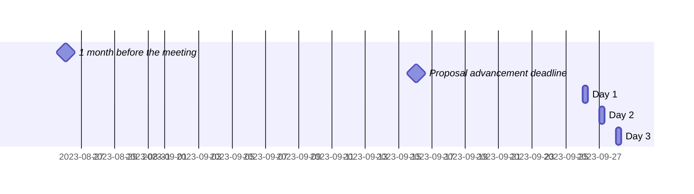

 <!-- markdownlint-disable-line MD041 -->

# Agenda for the 98th meeting of Ecma TC39

- **Host**: Bloomberg
- **Dates and times**:
  - 10:00 to 17:00 JST (Asia/Tokyo) on 26 September 2023
  - 10:00 to 17:00 JST (Asia/Tokyo) on 27 September 2023
  - 10:00 to 16:00 JST (Asia/Tokyo) on 28 September 2023
- **Location**: TOKYO, JAPAN
- **Attendee information**: https://github.com/tc39/Reflector/issues/499



For meeting times in your timezone, visit [Temporal docs](https://tc39.es/proposal-temporal/docs/) and run the code below in the devtools console.

```js
// UPDATE THE START DATE AND IANA TIMEZONE NAME BELOW AND DELETE THIS COMMENT
Temporal.ZonedDateTime.from('2023-09-26T10:00[Asia/Tokyo]')
  .withTimeZone(Temporal.Now.timeZoneId()) // your time zone
  .toLocaleString()
```

Background:

- Allen Wirfs-Brock's [paper on standards committee participation for new attendees](http://wirfs-brock.com/allen/files/papers/standpats-asianplop2016.pdf)
- TC39's documentation on [How to participate in meetings](https://github.com/tc39/how-we-work/blob/HEAD/how-to-participate-in-meetings.md)

## Agenda topic rules

Deadline for advancement eligibility: [September 16th, 10:00 JST](https://www.timeanddate.com/countdown/generic?p0=1440&iso=20230916T01&msg=TC39%20Submission%20deadline)

- <sub>Note: this time is selected to be precisely 10 days prior to the start of the meeting</sub>

1. Proposals not looking to advance may be added at any time; if after the deadline, please always use a pull request so that members are notified of changes. Note: an unmerged PR counts as “added” for the purposes of this requirement.
1. Proposals seeking feedback at stage 0 must be added (and noted as such) prior to the deadline, or else delegates may object to advancement solely on the basis of missing the deadline.
    1. Such proposals *should* include supporting materials when possible.
1. Proposals looking to advance to stage 1 must be added (and noted as such) prior to the deadline, or else delegates may object to advancement solely on the basis of missing the deadline.
    1. Such proposals *must* link to a proposal repository and they *should* link to supporting materials when possible.
1. Proposals looking to advance to stages 2, 3, or 4, as well as other normative changes to the standard or proposals in stage 3 or later looking to achieve consensus, must be added (and noted as such) *along with links to the supporting materials* prior to the deadline, or else delegates may withhold consensus for advancement solely on the basis of missing the deadline.
    1. If the supporting materials change substantially after the deadline, delegates may withhold consensus for advancement, based on the committee’s judgment.
    1. For urgent normative changes, the committee is expected to be more forgiving of a missed deadline, since there is generally less material to review than in a stage advancement.
    1. Proposals looking to advance to stage 4 *must* link to a pull request into [the spec](https://github.com/tc39/ecma262), since the [process](https://tc39.github.io/process-document/) requires one.
1. Proposal-based agenda items should be sorted primarily by stage (descending), secondarily by timebox (ascending), and finally by insertion date.

Supporting materials includes slides, a link to the proposal repository, a link to spec text, etc.; essentially, anything you are planning to present to the committee, or that would be useful for delegates to review.

## Agenda key

When applicable, use these emoji as a prefix to the agenda item topic.

| Emoji | Meaning                                                              |
| :---: | :---                                                                 |
|  ❄️   | hard schedule constraints apply to this agenda item (e.g. presenter) |
|  🔒   | schedule constraints apply to this agenda item                       |
|  ⌛️   | late addition for stage advancement and/or schedule prioritization   |
|  🔁   | continuation of a previous agenda item                               |

## Agenda items

1. Opening, welcome and roll call (Chair)
    1. Opening of the meeting
    1. TC39 follows its [Code of Conduct](https://tc39.github.io/code-of-conduct/)
    1. Introduction of attendees
    1. Host facilities, local logistics
    1. Quick recap of meeting IPR policy
    1. Overview of communication tools
    1. Reminder to review Github Delegate teams (Jordan Harband)
1. Find volunteers for note taking
1. Adoption of the agenda
1. Approval of the minutes from last meeting
1. Next meeting host and logistics
1. Secretary's Report [slides](./tc39-2023-040.pdf) (15m, Samina Husain)
    - [Guide to converting an Ecma standard from a ecmarkup generated HTML file into an Ecma format printable PDF](./Guide_cnvprocess_AllenWirfsBrock.pdf)
    - [Well-formatted PDFs for TC39 Standards in 2022 and Beyond](./PDFsforTC39.Standards_AllenWirfsBrock.pdf)
1. Project Editors’ Reports
    1. [ECMA262](https://github.com/tc39/ecma262) Status Updates ([slides](https://docs.google.com/presentation/u/1/d/14EMR7dyp5Fe7bZITKNP9upeV4OGo-wwtzWbPsC4cvk0/edit)) (15m)
    1. [ECMA402](https://github.com/tc39/ecma402) Status Updates (15m)
    1. [ECMA404](https://www.ecma-international.org/publications/standards/Ecma-404.htm) Status Updates (15m)
    1. [Test262](https://github.com/tc39/test262) Status Updates (15m)
1. Task Group Reports
    <!-- 1. TG2: Internationalization (5m) - in practice, this is covered via the ECMA-402 project editors' report -->
    1. TG3: Security (10m, Michael Ficarra)
    1. TG4: Source Maps (5m, Jon Kuperman)
1. Updates from the [CoC Committee](https://tc39.es/code-of-conduct/#code-of-conduct-committee) (5m, Jordan Harband)
1. [Web compatibility issues](https://github.com/tc39/ecma262/issues?utf8=✓&q=is%3Aopen+label%3A%22web+reality%22+is%3Aissue) / [Needs Consensus PRs](https://github.com/tc39/ecma262/pulls?q=is%3Apr+is%3Aopen+label%3A%22needs+consensus%22)

    | ✓ | timebox | topic | presenter |
    |:-:|:-------:|-------|-----------|
    |   | 5m      | needs consensus:  [ecma402#758](https://github.com/tc39/ecma402/pull/758)  Normative: Change the hourCycle default logic | Ben Allen |
    |   | 10m     | ⌛️ needs consensus:  [ecma402#780](https://github.com/tc39/ecma402/pull/780)  Normative: Added note about sets of locales for web browser implementations needing to not change as a result of user behaviour #780 | Ben Allen |
    |   | 10m     | needs consensus:  [ecma402#811](https://github.com/tc39/ecma402/pull/811)  Normative: Fix order of rounding* option reads and resolvedOptions() | Ben Allen |
    |   | 10m     | [Update GetSubstitution to match reality](https://github.com/tc39/ecma262/pull/3157) | Richard Gibson |
    |   | 20m     | ⌛️ needs consensus:  [ecma402#788](https://github.com/tc39/ecma402/pull/788)  Normative: Allow UTC offset time zones | Ben Allen |

1. Overflow from previous meeting

    | ✓ | timebox | topic | presenter |
    |:-:|:-------:|-------|-----------|

1. Incubation call chartering (15m on the last day)

1. Short (&le;30m) Timeboxed Discussions

    | ✓ | timebox | topic | presenter |
    |:-:|:-------:|-------|-----------|

1. Proposals

    ✓ represents an agenda item which has been presented, and does not indicate stage advancement

    | ✓ | stage | timebox | topic | presenter |
    |:-:|:-----:|:-------:|-------|-----------|
    | | 3 | 5m  | [Array Grouping](https://github.com/tc39/proposal-array-grouping/issues/60) update | Jordan Harband |
    | | 3 | 5m  | [ArrayBuffer transfer](https://github.com/tc39/proposal-arraybuffer-transfer/issues/12) update | Jordan Harband |
    | | 3 | 15m | [JSON.parse source text access](https://github.com/tc39/proposal-json-parse-with-source) update | Richard Gibson |
    | | 3 | 30m | [Iterator helper web incompat](https://github.com/tc39/proposal-iterator-helpers/issues/286) ([PR](https://github.com/tc39/proposal-iterator-helpers/pull/287)) | Shu-yu Guo &amp; Michael Ficarra |
    | | 3 | 30m | [Resizable buffers](https://github.com/tc39/proposal-resizablearraybuffer) for Stage 4 | Shu-yu Guo |
    | | 3 | 30m | [ShadowRealm](https://github.com/tc39/proposal-shadowrealm): Implementer Feedback and Demotion to Stage 2 ([slides](https://docs.google.com/presentation/d/1WJd9g3df_ibVHK3LdoKX2FboDwYQBUBJNxuRAWOYYbM/))| Daniel Minor |
    | | 3 | 30m | Stage 3 update of [Intl Locale Info API](https://github.com/tc39/proposal-intl-locale-info) ([Slides](https://docs.google.com/presentation/d/1pr3lp_gPcaitmmiQZq2xQGEoG-1cfpOU1agLKAYmPqQ/edit#slide=id.g15fa621a7a8_0_37) ) | Frank Yung-Fong Tang |
    | | 3 | 15m | [Import Attributes](https://github.com/tc39/proposal-import-attributes/) Implementer Feedback ([slides](https://docs.google.com/presentation/d/1AvdsT0k_etbelbE_HEdEY8YHLbsDv0ObWBaAhDm3TAE/)) | Daniel Minor |
    | | 2 | 5m  | [Symbol predicates](https://github.com/tc39/proposal-symbol-predicates/issues/11) update | Jordan Harband |
    | | 2 | 15m | [Async Iterator Helpers status update](https://github.com/tc39/proposal-async-iterator-helpers) (slides TK; tldr work continues) | Kevin Gibbons |
    | | 2 | 30m | [Throw Expressions](https://github.com/tc39/proposal-throw-expressions) for Stage 3 ([slides](https://1drv.ms/p/s!AjgWTO11Fk-TkpMZ8VFwRDwz95R92w?e=oZdYRY), [spec](https://tc39.es/proposal-throw-expressions/pr/17)) | Ron Buckton |
    | | 2 | 30m | [AsyncContext](https://github.com/tc39/proposal-async-context) update ([slides](https://docs.google.com/presentation/d/12A3LYlqgzmqRqE0mJ47GRWB6uKlqoFXiWE9gsxpRje4/edit?usp=sharing)) | Chengzhong Wu |
    | | 2 | 45m | [Uint8Array-Base64](https://github.com/tc39/proposal-arraybuffer-base64): are we doing multi-shot? ([issue](https://github.com/tc39/proposal-arraybuffer-base64/issues/13)) | Kevin Gibbons |
    | | 1 | 5m  | [Pattern Matching](https://github.com/tc39/proposal-pattern-matching) update | Jordan Harband |
    | | 1 | 15m | Withdrawing [FinalizationRegistry cleanupSome](https://github.com/tc39/proposal-cleanup-some) ([slides](https://docs.google.com/presentation/d/18V56wPFL3TZ2hgvK3b9zQsvLaw4aGdy_asxJ_6at_hs/edit#slide=id.p)) | Daniel Ehrenberg |
    | | 1 | 30m | Withdrawing [operator overloading](https://github.com/tc39/proposal-operator-overloading) ([slides](https://docs.google.com/presentation/d/1mT2VmZlC3YmhDsqdxrCxQ5GpLFHFntsb3XCM762eDvg/edit#slide=id.p)) | Daniel Ehrenberg |
    | | 1 | 20m | Withdrawing [numeric literal suffixes](https://github.com/tc39/proposal-extended-numeric-literals) ([slides](https://docs.google.com/presentation/d/1me-RkloXmBJhDJKG3rl_q0CYW2KO_QFnvIPmIRmQhsw/edit#slide=id.g27efdfda19b_0_0)) | Daniel Ehrenberg |
    | | 1 | 30m | reviving [export default from](https://github.com/tc39/proposal-export-default-from); for stage 2? | Jordan Harband |
    | | 1 | 30m | [Get Intrinsics](https://github.com/tc39/proposal-get-intrinsic) for stage 2, with two possible shapes/paths? | Jordan Harband |
    | | 1 | 30m | [DataView get/set Uint8Clamped methods](https://github.com/tc39/proposal-dataview-get-set-uint8clamped) for stage 2 | Jordan Harband |
    | | 1 | 30m | [RegExp.escape](https://github.com/tc39/proposal-regex-escaping) for stage 2 | Jordan Harband |
    | | 1 | 45m | [Intl.MessageFormat](https://github.com/tc39/proposal-intl-messageformat): Stage 1 update and discussion ([slides](https://docs.google.com/presentation/d/15lwZipk0k5pMscSBbEPpMySsnM_qd4MOo_NqmmKyS-Q/))| Eemeli Aro |
    | | 1 | 60m | [Structs and shared structs](https://github.com/tc39/proposal-structs) update | Shu-yu Guo |
    | | 1 | 60m | [Decimal](https://github.com/tc39/proposal-decimal): Stage 1 update and discussion ([slides](https://docs.google.com/presentation/d/1xOvWslwKi6evMWMYk1PQv9H0IEIhsifHbEBh2BOqHa0/))| Jesse Alama |
    | | 1 | 60m | [Type Annotations](https://github.com/tc39/proposal-type-annotations): Stage 1 update and discussion ([slides](https://docs.google.com/presentation/d/1rwrWQkYityiK1pf5UpkgRYMKL8euqtDrrrbngMKJusY/edit?usp=sharing))| Daniel Ehrenberg and Daniel Rosenwasser |
    | | 0 | 1m  | Withdrawing [Symbol.thenable](https://github.com/devsnek/proposal-symbol-thenable) | Jordan Harband |
    | | 0 | 30m | [iterator sequencing](https://github.com/michaelficarra/proposal-iterator-sequencing) for Stage 1 ([slides](https://docs.google.com/presentation/d/1myebbwYiacqh419Vi2-EjtcQcaWpyMlZ8lbayi5OAZs)) | Michael Ficarra |
    | | 0 | 30m | [joint iteration](https://github.com/michaelficarra/proposal-joint-iteration) for Stage 1 ([slides](https://docs.google.com/presentation/d/18Xnd--QmYV8c-qw3tGe4zvlIfF5A-CdXr-qW1tW6j4o)) | Michael Ficarra |
    | | 0 | 30m | [Stable Formatting](https://github.com/eemeli/proposal-stable-formatting) for Stage 1 ([slides](https://docs.google.com/presentation/d/1p1Xgywv1qfY54gnfHUM6PXQafqgf7wY98znxbolmP2c/edit?usp=sharing))| Eemeli Aro |
    | | 0 | 30m | [Negated `in` and `instanceof` operators](https://github.com/gorosgobe/proposal-negated-in-instanceof) for Stage 1 ([slides](https://docs.google.com/presentation/d/1vwNOjUiUvy6TzK6t0Mb8qgyKwBNszly9HibJJpUa_Eo/edit?usp=sharing)) | Pablo Gorostiaga Belio |
    | | 0 | 30m | [Locale Extensions](https://github.com/ben-allen/locale-extensions) for Stage 1  (slides TBD)| Ben Allen |

1. Longer or open-ended discussions

    | ✓ | timebox | topic | presenter |
    |:-:|:-------:|-------|-----------|
    | | 60m | TDZ, what is it good for? | Shu-yu Guo |
    | | 90m | reducing wasted effort due to proposal churn (continued) ([slides](https://docs.google.com/presentation/d/1HtcFY98qWy-LPJLawRIkYzhDEjuEeyArMiNXbCOFcrk/view)) | Michael Ficarra |
    | | 60m | Stop coercing things pt 2 ([slides](https://docs.google.com/presentation/d/1VwHSzNOAjR6nZkO2DMOAkoyIwaVcjqhT7VOaNiWm8ho/edit)) | Kevin Gibbons |

1. Overflow from timeboxed agenda items (in insertion order)

    | ✓ | topic | presenter |
    |:-:|-------|-----------|

1. Other business
    1. Thank host
1. Adjournment

### Schedule constraints

*Schedule constraints should be supplied here **48 hours** before the meeting begins so that the Chairs can take them into account when preparing the schedule.*

<!-- Be specific! Provide a full name, date and time range that they will or will not be available, and which sessions they are trying to prioritize. Satisfaction not guaranteed, but more information is useful. Conflicting constraints honored on a first-come, first served basis. -->

1. Custom numeric literals must be after operator overloading (since the decisions are dependent on each other).

#### Normal Constraints

<!-- Constraints supplied more than 48 hours before the meeting should go here -->
- Caridy Patino and Leo Balter would like to be present for the ShadowRealm topic but are limited to the first 2 hours for the meeting each day (10:00 to 12:00 JST).

#### Late-breaking Schedule Constraints

<!-- Constraints supplied less than 48 hours before the meeting should go here -->

## Dates and locations of future meetings

| Dates                    | Location            | Host                 |
|--------------------------|---------------------|----------------------|
| 2023-11-27 to 2023-11-30 | *Remote: "SF"*      |                      |
