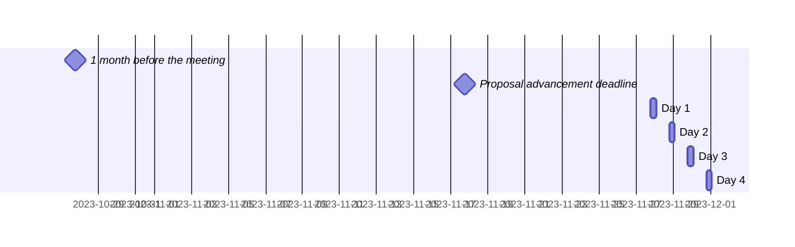

 <!-- markdownlint-disable-line MD041 -->

# Agenda for the 99th meeting of Ecma TC39

- **Host**: Remote
- **Dates and times**:
  - 10:00 to 15:00 PST (America/Los\_Angeles) on 27 November 2023
  - 10:00 to 15:00 PST (America/Los\_Angeles) on 28 November 2023
  - 10:00 to 15:00 PST (America/Los\_Angeles) on 29 November 2023
  - 10:00 to 15:00 PST (America/Los\_Angeles) on 30 November 2023
- **Attendee information**: https://github.com/tc39/Reflector/issues/509



For meeting times in your timezone, visit [Temporal docs](https://tc39.es/proposal-temporal/docs/) and run the code below in the devtools console.

```js
Temporal.ZonedDateTime.from('2023-11-27T10:00[America/Los_Angeles]')
  .withTimeZone(Temporal.Now.timeZoneId()) // your time zone
  .toLocaleString()
```

Background:

- Allen Wirfs-Brock's [paper on standards committee participation for new attendees](http://wirfs-brock.com/allen/files/papers/standpats-asianplop2016.pdf)
- TC39's documentation on [How to participate in meetings](https://github.com/tc39/how-we-work/blob/HEAD/how-to-participate-in-meetings.md)

## Agenda topic rules

Deadline for advancement eligibility: [November 17th, 10:00 PST](https://www.timeanddate.com/countdown/generic?p0=1440&iso=20231117T18&msg=TC39%20Submission%20deadline)

- <sub>Note: this time is selected to be precisely 10 days prior to the start of the meeting</sub>

1. Proposals not looking to advance may be added at any time; if after the deadline, please always use a pull request so that members are notified of changes. Note: an unmerged PR counts as “added” for the purposes of this requirement.
1. Proposals seeking feedback at stage 0 must be added (and noted as such) prior to the deadline, or else delegates may object to advancement solely on the basis of missing the deadline.
    1. Such proposals *should* include supporting materials when possible.
1. Proposals looking to advance to stage 1 must be added (and noted as such) prior to the deadline, or else delegates may object to advancement solely on the basis of missing the deadline.
    1. Such proposals *must* link to a proposal repository and they *should* link to supporting materials when possible.
1. Proposals looking to advance to stages 2, 3, or 4, as well as other normative changes to the standard or proposals in stage 3 or later looking to achieve consensus, must be added (and noted as such) *along with links to the supporting materials* prior to the deadline, or else delegates may withhold consensus for advancement solely on the basis of missing the deadline.
    1. If the supporting materials change substantially after the deadline, delegates may withhold consensus for advancement, based on the committee’s judgment.
    1. For urgent normative changes, the committee is expected to be more forgiving of a missed deadline, since there is generally less material to review than in a stage advancement.
    1. Proposals looking to advance to stage 4 *must* link to a pull request into [the spec](https://github.com/tc39/ecma262), since the [process](https://tc39.github.io/process-document/) requires one.
1. Proposal-based agenda items should be sorted primarily by stage (descending), secondarily by timebox (ascending), and finally by insertion date.

Supporting materials includes slides, a link to the proposal repository, a link to spec text, etc.; essentially, anything you are planning to present to the committee, or that would be useful for delegates to review.

## Agenda key

When applicable, use these emoji as a prefix to the agenda item topic.

| Emoji | Meaning                                                              |
| :---: | :---                                                                 |
|  ❄️    | hard schedule constraints apply to this agenda item (e.g. presenter) |
|  🔒   | schedule constraints apply to this agenda item                       |
|  ⌛️   | late addition for stage advancement and/or schedule prioritization   |
|  🔁   | continuation of a previous agenda item                               |

## Agenda items

1. Opening, welcome and roll call (Chair)
    1. Opening of the meeting
    1. TC39 follows its [Code of Conduct](https://tc39.github.io/code-of-conduct/)
    1. Introduction of attendees
    1. Host facilities, local logistics
    1. Quick recap of meeting IPR policy
    1. Overview of communication tools
    1. Reminder to review Github Delegate teams (Jordan Harband)
1. Find volunteers for note taking
    1. [Note about meeting transcriptions](https://github.com/tc39/Reflector/issues/460)
1. Adoption of the agenda
1. Approval of the minutes from last meeting
1. Next meeting host and logistics
1. Secretary's Report (15m, Samina Husain)
1. Project Editors’ Reports
    1. [ECMA262](https://github.com/tc39/ecma262) Status Updates (15m)
    1. [ECMA402](https://github.com/tc39/ecma402) Status Updates (15m)
    1. [ECMA404](https://www.ecma-international.org/publications/standards/Ecma-404.htm) Status Updates (15m)
    1. [Test262](https://github.com/tc39/test262) Status Updates (15m)
1. Task Group Reports
    <!-- 1. TG2: Internationalization (5m) - in practice, this is covered via the ECMA-402 project editors' report -->
    1. TG3: Security (5m)
    1. TG4: Source Maps (5m)
1. Updates from the [CoC Committee](https://tc39.es/code-of-conduct/#code-of-conduct-committee) (5m)
1. [Web compatibility issues](https://github.com/tc39/ecma262/issues?utf8=✓&q=is%3Aopen+label%3A%22web+reality%22+is%3Aissue) / [Needs Consensus PRs](https://github.com/tc39/ecma262/pulls?q=is%3Apr+is%3Aopen+label%3A%22needs+consensus%22)

    | ✓ | timebox | topic | presenter |
    |:-:|:-------:|-------|-----------|
    |   | 30m     | Provide source text to HostEnsureCanCompileStrings PR [#3222](https://github.com/tc39/ecma262/pull/3222) | Nicolò Ribaudo, Philip Chimento |

1. Overflow from previous meeting

    | ✓ | timebox | topic | presenter |
    |:-:|:-------:|-------|-----------|
    |   | 30m | :hourglass: Withdrawing [operator overloading](https://github.com/tc39/proposal-operator-overloading) ([slides](https://docs.google.com/presentation/d/1mT2VmZlC3YmhDsqdxrCxQ5GpLFHFntsb3XCM762eDvg/edit#slide=id.p)) | Daniel Ehrenberg |
    |   | 20m | :hourglass: Withdrawing [numeric literal suffixes](https://github.com/tc39/proposal-extended-numeric-literals) ([slides](https://docs.google.com/presentation/d/1me-RkloXmBJhDJKG3rl_q0CYW2KO_QFnvIPmIRmQhsw/edit#slide=id.g27efdfda19b_0_0)) | Daniel Ehrenberg |

1. Incubation call chartering (15m on the last day)

1. Short (&le;30m) Timeboxed Discussions

    | ✓ | timebox | topic | presenter |
    |:-:|:-------:|-------|-----------|
    |   | 2m  | Recruiting people interested in JSX to join the [matrix room](https://matrix.to/#/#jsx:matrix.org) | Jack Works |
    |   | 10m | publishing an [FAQs document](https://github.com/tc39/faq) | Michael Ficarra |
    |   | 20m | present TCQ reloaded update and get initial feedback | Christian Ulbrich |

1. Proposals

    ✓ represents an agenda item which has been presented, and does not indicate stage advancement

    | ✓ | stage | timebox | topic | presenter |
    |:-:|:-----:|:-------:|-------|-----------|
    |   | 3     | 5m  | [RegExp Modifiers](https://github.com/tc39/proposal-regexp-modifiers) stage 3 update ([slides](https://1drv.ms/p/s!AjgWTO11Fk-TkpR3y23lo5uqnkyQVA?e=UIpIZP), [spec](https://tc39.es/proposal-regexp-modifiers)) | Ron Buckton |
    |   | 3     | 5m  | [Array Grouping](https://github.com/tc39/proposal-array-grouping/issues/60) for stage 4 ([PR](https://github.com/tc39/ecma262/pull/3176)) | Jordan Harband |
    |   | 3     | 5m  | [`Promise.withResolvers`](https://github.com/tc39/proposal-promise-with-resolvers) for stage 4 ([PR](https://github.com/tc39/ecma262/pull/3179)) | Peter Klecha |
    |   | 3     | 30m | Stage 3 update of [Intl Locale Info API](https://github.com/tc39/proposal-intl-locale-info) (Slides TBW) | Frank Yung-Fong Tang |
    |   | 3     | 30m | [Temporal](https://github.com/tc39/proposal-temporal) normative PR [#2718](https://github.com/tc39/proposal-temporal/pull/2718) & general update (slides to follow) | Philip Chimento |
    |   | 3     | 30m | Intl.DurationFormat stage 3 update and normative PRs ([slides](https://docs.google.com/presentation/d/1_e1qU8toLiXCR3IB-JEqXMnsV_iYpt9z)) (additional slides to follow) | Ben Allen |
    |   | 3     | 30m | :hourglass: Decorators normative update re: extra initializers ([PR](https://github.com/pzuraq/ecma262/pull/12)) | Kristen Hewell Garrett |
    |   | 3     | 30m | Iterator helpers [web compat](https://github.com/tc39/proposal-iterator-helpers/issues/286) continuation (backup [PR](https://github.com/tc39/proposal-iterator-helpers/pull/287)) | Michael Ficarra &amp; Shu-yu Guo |
    |   | 2     | 15m | [ShadowRealm](https://github.com/tc39/proposal-shadowrealm) stage 2 update | Leo Balter |
    |   | 2     | 30m | [Deferred import evaluation](https://github.com/tc39/proposal-defer-import-eval/): deferred re-exports ([slides](https://docs.google.com/presentation/d/1l-H2ntEDZGAWvtuOup1TJdylZsV1epKVSejVM-GwHLU/edit#slide=id.g29b94779710_0_0)) | Nicolò Ribaudo |
    |   | 2     | 60m | [Base64 Uint8Arrays](https://github.com/tc39/proposal-arraybuffer-base64/) for further discussion (slides TK) | Kevin Gibbons |
    |   | 1     | 30m | [Joint Iteration](https://github.com/tc39/proposal-joint-iteration) stage 1 update and request for feedback ([slides](https://docs.google.com/presentation/d/1sgqXgWBsDF0S43wVuFgIyOC8Y3AMFt1qxBIFbzEq9Vg)) | Michael Ficarra |
    |   | 1     | 45m | [Slice notation](https://github.com/tc39/proposal-slice-notation) stage 1 update (slides TBD) | HE Shi-Jun (hax) |
    |   | 1     | 60m | [Decimal](https://github.com/tc39/proposal-decimal/) stage 1 update & request for feedback ([slide](https://docs.google.com/presentation/d/1ecK7CzrgSO5t8-gYQnNWUSHcnWltJKWqTolgJsAIwqI/)) | Jesse Alama |
    |   | 0     | 10m | [JSON.tryParse](https://github.com/Jack-Works/proposal-json-tryParse) for stage 1 | Jack-Works |
    |   | 0     | 15m | [`a[^i]`](https://github.com/hax/proposal-index-from-end) for stage 1 (slides TBD) | HE Shi-Jun (hax) |
    |   | 0     | 30m | [Module sync assert](https://github.com/Jack-Works/proposal-module-sync-assert) for stage 1 | Jack-Works |
    |   | 0     | 30m | [Math.sum](https://github.com/bakkot/proposal-math-sum) for stage 1 | Kevin Gibbons |

1. Longer or open-ended discussions

    | ✓ | timebox | topic | presenter |
    |:-:|:-------:|-------|-----------|
    |   | 90m | continuation of the new stage discussion ([PR](https://github.com/tc39/process-document/pull/37)) ([slides](https://docs.google.com/presentation/d/1vdps2Ga2eHYhCSDN6pmYYWtPKfAsgP_i88sLlqEq-Xo)) | Michael Ficarra |
    |   | 60m | Stop coercing things pt 3 ([slides](https://docs.google.com/presentation/d/1AFzFeVtbUCpPcMXTER0Zzb5l5c5oPdXCF4Yi_9B1EEM/edit)) | Kevin Gibbons |

1. Overflow from timeboxed agenda items (in insertion order)

    | ✓ | topic | presenter |
    |:-:|-------|-----------|

1. Other business
    1. Thank host
1. Adjournment

### Schedule constraints

*Schedule constraints should be supplied here **48 hours** before the meeting begins so that the Chairs can take them into account when preparing the schedule.*

<!-- DO NOT PUT YOUR CONSTRAINTS HERE! Put them in one of the next sections: either "Normal Constraints" or "Late-breaking Schedule Constraints" -->

<!-- Be specific! Provide a full name, date and time range that they will or will not be available, and which sessions they are trying to prioritize. Satisfaction not guaranteed, but more information is useful. Conflicting constraints honored on a first-come, first served basis. -->

#### Normal Constraints

<!-- Constraints supplied more than 48 hours before the meeting should go here -->

- Shu-yu Guo will **only** be available on Nov 27. Ideally, as many (if any) stage 3+ advancement items should be on that day. If not, materials should be made available ahead of time. Also prefer to be present for Decimal.
- Nicolô Ribaudo *prefers* (i.e. consider this a low-priority constraint) to present "Deferred import evaluation" in the morning
- The two topics presented by HE Shi-Jun (hax) are highly related and should be scheduled within the same time frame (the only reason they are separated on the schedule is due to the different stages). To accommodate time zone differences, hax would like their topics to be arranged on the third or fourth day.

#### Late-breaking Schedule Constraints

<!-- Constraints supplied less than 48 hours before the meeting should go here -->
