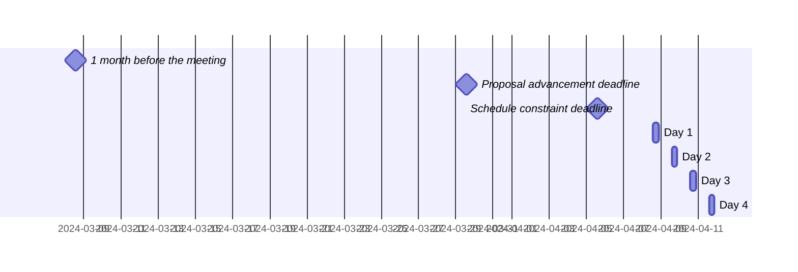

 <!-- markdownlint-disable-line MD041 -->

# Agenda for the 101st meeting of Ecma TC39

- **Host**: Remote
- **Dates and times**:
  - 10:00 to 15:00 ET (America/New_York) on 8 April 2024
  - 10:00 to 15:00 ET (America/New_York) on 9 April 2024
  - 10:00 to 15:00 ET (America/New_York) on 10 April 2024
  - 10:00 to 15:00 ET (America/New_York) on 11 April 2024
- **Attendee information**: https://github.com/tc39/Reflector/issues/522



For meeting times in your timezone, visit [Temporal docs](https://tc39.es/proposal-temporal/docs/) and run the code below in the devtools console.

```js
Temporal.ZonedDateTime.from('2024-04-08T10:00[America/New_York]')
  .withTimeZone(Temporal.Now.timeZoneId()) // your time zone
  .toLocaleString()
```

Background:

- Allen Wirfs-Brock's [paper on standards committee participation for new attendees](http://wirfs-brock.com/allen/files/papers/standpats-asianplop2016.pdf)
- TC39's documentation on [How to participate in meetings](https://github.com/tc39/how-we-work/blob/HEAD/how-to-participate-in-meetings.md)

## Agenda topic rules

Deadline for advancement eligibility: [March 29th, 10:00 ET](https://www.timeanddate.com/countdown/spring?iso=20240329T10&p0=179&msg=TC39+Submission+deadline&font=slab)

- <sub>Note: this time is selected to be precisely 10 days prior to the start of the meeting</sub>

1. Proposals not looking to advance may be added at any time; if after the deadline, please always use a pull request so that members are notified of changes. Note: an unmerged PR counts as “added” for the purposes of this requirement.
1. Proposals seeking feedback at stage 0 must be added (and noted as such) prior to the deadline, or else delegates may object to advancement solely on the basis of missing the deadline.
    1. Such proposals *should* include supporting materials when possible.
1. Proposals looking to advance to stage 1 must be added (and noted as such) prior to the deadline, or else delegates may object to advancement solely on the basis of missing the deadline.
    1. Such proposals *must* link to a proposal repository and they *should* link to supporting materials when possible.
1. Proposals looking to advance to stages 2, 2.7, 3, or 4, as well as other normative changes to the standard or proposals in stage 3 or later looking to achieve consensus, must be added (and noted as such) *along with links to the supporting materials* prior to the deadline, or else delegates may withhold consensus for advancement solely on the basis of missing the deadline.
    1. If the supporting materials change substantially after the deadline, delegates may withhold consensus for advancement, based on the committee’s judgment.
    1. For urgent normative changes, the committee is expected to be more forgiving of a missed deadline, since there is generally less material to review than in a stage advancement.
    1. Proposals looking to advance to stage 4 *must* link to a pull request into [the spec](https://github.com/tc39/ecma262), since the [process](https://tc39.github.io/process-document/) requires one.
1. Proposal-based agenda items should be sorted primarily by stage (descending), secondarily by timebox (ascending), and finally by insertion date.

Supporting materials includes slides, a link to the proposal repository, a link to spec text, etc.; essentially, anything you are planning to present to the committee, or that would be useful for delegates to review.

## Agenda key

When applicable, use these emoji as a prefix to the agenda item topic.

| Emoji | Meaning                                                              |
| :---: | :---                                                                 |
|  ❄️    | hard schedule constraints apply to this agenda item (e.g. presenter) |
|  🔒   | schedule constraints apply to this agenda item                       |
|  ⌛️   | late addition for stage advancement and/or schedule prioritization   |
|  🔁   | continuation of a previous agenda item                               |

## Agenda items

1. Opening, welcome and roll call (Chair)
    1. Opening of the meeting
    1. TC39 follows its [Code of Conduct](https://tc39.github.io/code-of-conduct/)
    1. Introduction of attendees
    1. Host facilities, local logistics
    1. Quick recap of meeting IPR policy
    1. Overview of communication tools
    1. Reminder to review Github Delegate teams (Jordan Harband)
    1. [TC39 stenography support and legal disclaimer](https://github.com/tc39/Reflector/blob/main/transcriptions.md)
    1. Solar eclipse reminder: <https://www.nasa.gov/news-release/how-to-watch-upcoming-total-solar-eclipse-with-nasa-from-anywhere/>
1. Find volunteers for note taking
1. Adoption of the agenda
1. Approval of the minutes from last meeting
1. Next meeting host and logistics
1. Secretary's Report (15m, Samina Husain, [slides](tc39-2024-016.pdf))
1. Project Editors’ Reports
    1. [ECMA262](https://github.com/tc39/ecma262) Status Updates ([slides](https://docs.google.com/presentation/d/1mXvZ-hgyjFca8BzqZ5jzFSa3AdCcr3rFkINaeZ857nA/edit)) (5m, Kevin Gibbons)
        1. [update on automatically producing print-quality PDFs](https://docs.google.com/presentation/d/1kCDZewoWZtL26FnFSiK4tr6ZotGo7TR0_AZGlCwHiEQ/edit) (30m, Michael Ficarra)
    1. [ECMA402](https://github.com/tc39/ecma402) Status Updates (15m)
    1. [ECMA404](https://www.ecma-international.org/publications/standards/Ecma-404.htm) Status Updates (1m, Chip Morningstar)
    1. [Test262](https://github.com/tc39/test262) Status Updates (10m, Philip Chimento)
1. Task Group Reports
    <!-- 1. TG2: Internationalization (5m) - in practice, this is covered via the ECMA-402 project editors' report -->
    1. TG3: Security (5m, Chris de Almeida)
       1. TG3 convenors appointment (5m, Ujjwal Sharma)
    1. TG4: Source Maps (5m, Jon Kuperman) ([slides](https://docs.google.com/presentation/d/1t2Fu12Dc8kfe27rNDGVAfCXDXkU5cKC32qryJ_aiDug/edit?usp=sharing))
    1. TG5: Experiments in Programming Language Standardization (5m) ([slides](https://docs.google.com/presentation/d/1VNMBDlKZJNHJqh76oxiGXbANT9Oq4AYhtMTomudp4GU/edit?usp=sharing))
1. Updates from the [CoC Committee](https://tc39.es/code-of-conduct/#code-of-conduct-committee) (5m, Chris de Almeida)
1. [Web compatibility issues](https://github.com/tc39/ecma262/issues?utf8=✓&q=is%3Aopen+label%3A%22web+reality%22+is%3Aissue) / [Needs Consensus PRs](https://github.com/tc39/ecma262/pulls?q=is%3Apr+is%3Aopen+label%3A%22needs+consensus%22)

    | ✓ | timebox | topic | presenter |
    |:-:|:-------:|-------|-----------|
    |   | 15m     | [Reality and spec differ on property key resolution timing for `o[p] = f()`](https://github.com/tc39/ecma262/issues/3295 ) ([PR](https://github.com/tc39/ecma262/pull/3307)) | Ross Kirsling |

1. Overflow from previous meeting

    | ✓ | timebox | topic | presenter |
    |:-:|:-------:|-------|-----------|

1. Short (&le;30m) Timeboxed Discussions

    | ✓ | timebox | topic | presenter |
    |:-:|:-------:|-------|-----------|
    |   | 1m      | “array last” proposal [withdrawn](https://github.com/tc39/proposals/pull/511) | Jordan Harband |
    |   | 1m      | TC39 website - call for translators - [GH issue](https://github.com/tc39/tc39.github.io/issues/406) | Chris de Almeida |

1. Proposals

    ✓ represents an agenda item which has been presented, and does not indicate stage advancement

    | ✓ | stage | timebox | topic | presenter |
    |:-:|:-----:|:-------:|-------|-----------|
    |   | 3     | 10m     | [Duplicate named capture groups](https://github.com/tc39/proposal-duplicate-named-capturing-groups) for stage 4 ([PR](https://github.com/tc39/ecma262/pull/2721), [tests](https://github.com/tc39/test262/pull/3625)) | Kevin Gibbons |
    |   | 3     | 10m     | [Set methods](https://github.com/tc39/proposal-set-methods) for stage 4 ([PR](https://github.com/tc39/ecma262/pull/3306), [tests](https://github.com/tc39/test262/pull/3966)) | Kevin Gibbons |
    |   | 3     | 15m     | [Temporal](https://github.com/tc39/proposal-temporal) normative bugfix ([PR](https://github.com/tc39/proposal-temporal/pull/2797), [slides](http://ptomato.name/talks/tc39-2024-04/)) | Philip Chimento |
    |   | 3     | 30m     | [Explicit Resource Management](https://github.com/tc39/proposal-explicit-resource-management) Normative Updates and Needs Consensus PRs ([slides](https://1drv.ms/p/s!AjgWTO11Fk-TkqpkI6V9_w6ykvsG1w?e=ehAC64), [PRs](https://github.com/tc39/proposal-explicit-resource-management/pulls?q=is%3Aopen+is%3Apr+label%3Aneeds-consensus)) | Ron Buckton |
    |   | 2     | 10m     | [joint iteration](https://github.com/tc39/proposal-joint-iteration): confirm our stance on [#1](https://github.com/tc39/proposal-joint-iteration/issues/1#issuecomment-1981587641) | Michael Ficarra |
    |   | 2     | 15m     | ❄️ [AsyncContext](https://github.com/tc39/proposal-async-context/) Stage 2 [updates](https://docs.google.com/presentation/d/1ok6fX9PN3XEv9ZwffrDzJX24uuiNrkGDZN-KgGwGkc0/edit?usp=sharing) | Justin Ridgewell |
    |   | 2     | 20m     | [Promise.try](https://github.com/tc39/proposal-promise-try) for Stage 2.7 | Jordan Harband |
    |   | 2     | 20m     | [RegExp.escape](https://github.com/tc39/proposal-regex-escaping) for stage 2.7 | Jordan Harband |
    |   | 2     | 30m     | [Deferred import evaluation](https://github.com/tc39/proposal-defer-import-eval/) for Stage 2.7 (without "tree-shakeable" exports) ([slides](https://docs.google.com/presentation/d/1oPEF8nA9Iq5cAqjN-FqMigNNfz6lWCUbNfIsEjRXf4Y/edit?usp=sharing)) | Nicolò Ribaudo |
    |   | 2     | 30m     | [Treeshakeable/deferred re-exports](https://github.com/tc39/proposal-defer-import-eval/pull/30) status update ([slides](https://docs.google.com/presentation/d/1iM5cRgdRXLWLq_GxgRvzYmUTXEK6gzH_8QNgLKMmv7o/edit?usp=sharing)) | Nicolò Ribaudo |
    |   | 2     | 30m     | [Make eval-introduced global vars redeclarable](https://github.com/tc39/proposal-redeclarable-global-eval-vars) for stage 2.7 ([slides](https://docs.google.com/presentation/d/1p--DB6SNlDv5XOn9g4bmwoymYQ93VWK_RDrCHLJJd60/edit?usp=sharing)) | Shu-yu Guo |
    |   | 2     | 30m     | [Iterator.range](https://github.com/tc39/proposal-iterator.range) for stage 2.7 | Jack Works |
    |   | 2     | 30m     | [Math.sumExact](https://github.com/tc39/proposal-math-sum) for stage 2.7 ([slides](https://docs.google.com/presentation/d/1QallvKcuIL2UHALEYnP4AdT8nX_iZ6QHDgpVISUXHMg/edit?usp=sharing)) | Kevin Gibbons |
    |   | 2     | 60m     | Discussing new directions for [R&T](https://github.com/tc39/proposal-record-tuple) ([slides](https://docs.google.com/presentation/d/1JfChmW8tQ2_mrFDynosNqa1tjJ2j-qX6WoKm8vc_tkY/), [related repo](https://github.com/acutmore/proposal-keyby)) | Ashley Claymore |
    |   | 2     | 60m     | [Array.isTemplateObject](https://github.com/tc39/proposal-array-is-template-object) next steps ([slides](https://docs.google.com/presentation/d/1LTlzpboYwKxRwigATcFYEh06CIbZvOvmFdPzkNn7vJI/edit#slide=id.g2cae2397581_0_66)) | Daniel Ehrenberg |
    |   | 1     | 15m     | [`Atomics.microwait()`](https://github.com/syg/proposal-atomics-microwait) (without mini wait) for stage 2 ([slides](https://docs.google.com/presentation/d/1Sb4Qaa5F8ZM9X0kxv5e-Wh5CbT1ZoryeCtVShoVhu8Y/edit?usp=sharing)) | Shu-yu Guo |
    |   | 1     | 30m     | `eval`/`new Function` changes for Trusted Types as Normative PR or Stage 3 ([PR](https://github.com/tc39/ecma262/pull/3294), [slides](https://docs.google.com/presentation/d/14AjvbW2-aNvlirB-7pPhIAeM7oWKtjqONRcyp9ID7gg/edit?usp=sharing)) | Nicolò Ribaudo |
    |   | 1     | 30m     | [ESM Source Phase](https://github.com/tc39/proposal-esm-phase-imports) status update and [layering change](https://github.com/tc39/proposal-source-phase-imports/pull/62) ([slides](https://docs.google.com/presentation/d/1nbXtl77pc1YIau4O472wvAG1FCUnDwKkY-EX3mRnLsU/edit?usp=sharing) | Guy Bedford |
    |   | 1     | 30m     | [Module sync assert](https://github.com/tc39/proposal-module-sync-assert) for stage 2 | Jack Works |
    |   | 1     | 30m     | [Intl.MessageFormat](https://github.com/tc39/proposal-intl-messageformat) status update, maybe for stage 0? | Eemeli Aro |
    |   | 1     | 30m     | [Discard Bindings](https://github.com/tc39/proposal-discard-binding) for Stage 2 ([slides](https://1drv.ms/p/s!AjgWTO11Fk-TkqpoWw0poDW3dawBQg?e=O3UP1c), [spec](https://tc39.es/proposal-discard-binding/)) | Ron Buckton |
    |   | 1     | 45m     | [Extractors](https://github.com/tc39/proposal-extractors) for Stage 2 ([spec](https://tc39.es/proposal-extractors/), [slides](https://1drv.ms/p/s!AjgWTO11Fk-TkqpinLRBZZwud0rM9w?e=s7hKoI)) | Ron Buckton |
    |   | 1     | 60m     | [Decimal](https://github.com/tc39/proposal-decimal) for stage 2 ([slides](https://docs.google.com/presentation/d/1kXurIVl4kjzclwFgfzJqohtPyryeKI7Mn9C_w7aAYp8/)) | Jesse Alama |
    |   | 1     | 60m     | [Shared structs](https://github.com/tc39/proposal-structs) discussion ([slides](https://docs.google.com/presentation/d/1a53adMbL_Uqb1KxnY-r6Ie6n1PQXvNw3JgUOvRYFido/edit?usp=sharing)) | Shu-yu Guo |
    |   | 0     | 30m     | bringing back [Error.isError](https://github.com/ljharb/proposal-is-error), for stage 1 or 2 (or even 2.7) | Jordan Harband |
    |   | 0     | 30m     | [Strict Enforcement of 'using'](https://github.com/rbuckton/proposal-using-enforcement) for Stage 1 or 2 ([slides](https://1drv.ms/p/s!AjgWTO11Fk-TkqpmyWWWHf6TPYt2gg?e=fPIwaL&nav=eyJzSWQiOjI1NiwiY0lkIjoyMTg5ODA3Nzk5fQ), [spec](https://rbuckton.github.io/proposal-using-enforcement/)) | Ron Buckton |
    |   | 0     | 60m     | ⌛️ [Signals](https://github.com/proposal-signals/proposal-signals) for Stage 1 ([slides](https://docs.google.com/presentation/d/1MJqndTS5RmTEwTbtLTPsEloc-a_MWR8daQINgDim2RA/edit#slide=id.g1f570b058be_0_573)) | Daniel Ehrenberg and Jatin Ramanathan |

1. Longer or open-ended discussions

    | ✓ | timebox | topic | presenter |
    |:-:|:-------:|-------|-----------|
    |   | 45m     | Stop coercing things pt 4 ([slides](https://docs.google.com/presentation/d/1aumShXqYgQV38Bg_L3FfJvGKIupJVCxs_C-Iz3r_tRE/edit)) | Kevin Gibbons |

1. Overflow from timeboxed agenda items (in insertion order)

    | ✓ | topic | presenter |
    |:-:|-------|-----------|

1. Incubation call chartering (15m on the last day)

1. Adjournment

### Schedule constraints

*Schedule constraints should be supplied here as soon as possible, and **at least three days** before the meeting begins so that the Chairs can take them into account when preparing the schedule.*

<!-- DO NOT PUT YOUR CONSTRAINTS HERE! Put them in one of the next sections: either "Normal Constraints" or "Late-breaking Schedule Constraints" -->

<!-- Be specific! Provide a full name, date and time range that they will or will not be available, and which sessions they are trying to prioritize. Satisfaction not guaranteed, but more information is useful. Conflicting constraints honored on a first-come, first served basis. -->

#### Normal Constraints

<!-- Constraints supplied more than three days before the meeting should go here -->
- Ron Buckton will not be present on Day 1 of the plenary (April 8), but would like to be present for (w/highest priority first) Shared structs discussion, Pattern Matching, R&T, `Atomics.microwait()`, and Signals.
- Nicolò Ribaudo will not be available on Day 4, and would like to be present for (sorted by priority) ESM source phase, module sync assert, R&T.
- The changes for Trusted Types presentation should be before Array.isTemplateObject, ideally in the same day
- Eemeli Aro will not be present on Day 2 of the plenary (April 9).
- Ross Kirsling will only be available during the first hour of each day.
- Jesse Alama prefers to present the decimal presentation sometime in the first two hours. Any day is fine. A co-presenter in Asia (TC39 delegate from Albibaba) will make a 5-minute contribution during the decimal presentation, hence the request to have the presentation within the first two hours.
- Justin Ridgewell will not be available to present AsyncContext on day 1 (April 8).
- Andreu Botella will not be available for the first two hours of day 4 (April 11), and would like to be present for AsyncContext.

#### Late-breaking Schedule Constraints

<!-- Constraints supplied less than three days before the meeting should go here -->
