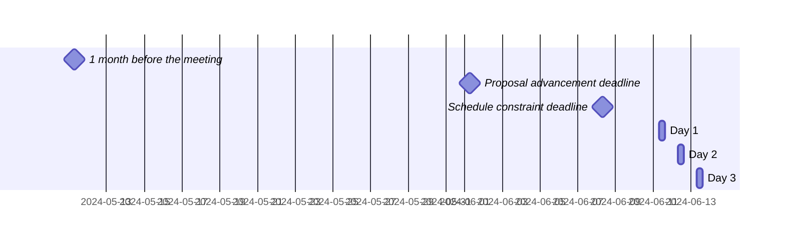

 <!-- markdownlint-disable-line MD041 -->

# Agenda for the 102nd meeting of Ecma TC39

- **Host**: Mozilla & Aalto University
- **Dates and times**:
  - 10:00 to 17:00 EEST (Europe/Helsinki) on 11 June 2024
  - 10:00 to 17:00 EEST (Europe/Helsinki) on 12 June 2024
  - 10:00 to 16:00 EEST (Europe/Helsinki) on 13 June 2024
- **Location**: Helsinki, Finland
- **Attendee information**: https://github.com/tc39/Reflector/issues/527



For meeting times in your timezone, visit [Temporal docs](https://tc39.es/proposal-temporal/docs/) and run the code below in the devtools console.

```js
Temporal.ZonedDateTime.from('2024-06-11T10:00[Europe/Helsinki]')
  .withTimeZone(Temporal.Now.timeZoneId()) // your time zone
  .toLocaleString()
```

Background:

- Allen Wirfs-Brock's [paper on standards committee participation for new attendees](http://wirfs-brock.com/allen/files/papers/standpats-asianplop2016.pdf)
- TC39's documentation on [How to participate in meetings](https://github.com/tc39/how-we-work/blob/HEAD/how-to-participate-in-meetings.md)

## Agenda topic rules

Deadline for advancement eligibility: [June 1st, 10:00 EEST](https://www.timeanddate.com/countdown/generic?p0=101&iso=20240601T10&msg=TC39%20Submission%20deadline)

- <sub>Note: this time is selected to be precisely 10 days prior to the start of the meeting</sub>

1. Proposals not looking to advance may be added at any time; if after the deadline, please always use a pull request so that members are notified of changes. Note: an unmerged PR counts as “added” for the purposes of this requirement.
1. Proposals seeking feedback at stage 0 must be added (and noted as such) prior to the deadline, or else delegates may object to advancement solely on the basis of missing the deadline.
    1. Such proposals *should* include supporting materials when possible.
1. Proposals looking to advance to stage 1 must be added (and noted as such) prior to the deadline, or else delegates may object to advancement solely on the basis of missing the deadline.
    1. Such proposals *must* link to a proposal repository and they *should* link to supporting materials when possible.
1. Proposals looking to advance to stages 2, 2.7, 3, or 4, as well as other normative changes to the standard or proposals in stage 3 or later looking to achieve consensus, must be added (and noted as such) *along with links to the supporting materials* prior to the deadline, or else delegates may withhold consensus for advancement solely on the basis of missing the deadline.
    1. If the supporting materials change substantially after the deadline, delegates may withhold consensus for advancement, based on the committee’s judgment.
    1. For urgent normative changes, the committee is expected to be more forgiving of a missed deadline, since there is generally less material to review than in a stage advancement.
    1. Proposals looking to advance to stage 4 *must* link to a pull request into [the spec](https://github.com/tc39/ecma262), since the [process](https://tc39.github.io/process-document/) requires one.
1. Proposal-based agenda items should be sorted primarily by stage (descending), secondarily by timebox (ascending), and finally by insertion date.

Supporting materials includes slides, a link to the proposal repository, a link to spec text, etc.; essentially, anything you are planning to present to the committee, or that would be useful for delegates to review.

## Agenda key

When applicable, use these emoji as a prefix to the agenda item topic.

| Emoji | Meaning                                                              |
| :---: | :---                                                                 |
|  ❄️    | hard schedule constraints apply to this agenda item (e.g. presenter) |
|  🔒   | schedule constraints apply to this agenda item                       |
|  ⌛️   | late addition for stage advancement and/or schedule prioritization   |
|  🔁   | continuation of a previous agenda item                               |

## Agenda items

1. Opening, welcome and roll call (Chair)
    1. Opening of the meeting
    1. TC39 follows its [Code of Conduct](https://tc39.github.io/code-of-conduct/)
    1. Introduction of attendees
    1. Host facilities, local logistics
    1. Quick recap of meeting IPR policy
    1. Overview of communication tools
    1. Reminder to review Github Delegate teams (Jordan Harband)
    1. [TC39 stenography support and legal disclaimer](https://github.com/tc39/Reflector/blob/main/transcriptions.md)
1. Find volunteers for note taking
1. Adoption of the agenda
1. Approval of the minutes from last meeting
1. Next meeting host and logistics
1. Secretary's Report ([slides](./tc39-2024-026.pdf)) (15m, Samina Husain)
1. Project Editors’ Reports
    1. [ECMA262](https://github.com/tc39/ecma262) Status Updates ([slides](https://docs.google.com/presentation/d/1tnLYexHxk1ygOkn_qevZHS1-MYggF258LNKvCdI0y6M/edit)) (15m)
    1. [ECMA402](https://github.com/tc39/ecma402) Status Updates ([slides](https://notes.igalia.com/p/5Tlry4MkK)) (15m)
    1. [ECMA404](https://www.ecma-international.org/publications/standards/Ecma-404.htm) Status Updates (15m)
    1. [Test262](https://github.com/tc39/test262) Status Updates (15m)
1. Task Group Reports
    <!-- 1. TG2: Internationalization (5m) - in practice, this is covered via the ECMA-402 project editors' report -->
    1. TG3: Security (5m)
    1. TG4: Source Maps (5m)
    1. TG5: Experiments in Programming Language Standardization ([slides](https://docs.google.com/presentation/d/1gG1gE0Ggwv9krUpWOhLyvohXGJzCzWiFTOOQ-R83zGs/edit?usp=sharing)) (5m, Mikhail Barash)
1. Updates from the [CoC Committee](https://tc39.es/code-of-conduct/#code-of-conduct-committee) (5m)
1. [Web compatibility issues](https://github.com/tc39/ecma262/issues?utf8=✓&q=is%3Aopen+label%3A%22web+reality%22+is%3Aissue) / [Needs Consensus PRs](https://github.com/tc39/ecma262/pulls?q=is%3Apr+is%3Aopen+label%3A%22needs+consensus%22)

    | timebox | topic | presenter |
    |:-------:|-------|-----------|
    |   20m   | ECMA-402 PR [#877](https://github.com/tc39/ecma402/pull/877): Specify time zone IDs to reduce divergence between engines ([slides](https://docs.google.com/presentation/d/1U_kNIpJb89LTSFh7BBiFIJSpW_epDSnzn4XKtER4IyQ/edit?usp=sharing))| Justin Grant |

1. Overflow from previous meeting

    | timebox | topic | presenter |
    |:-------:|-------|-----------|
    | 15m     | ⌛️🔁 Continuation from [previous meeting](https://github.com/tc39/notes/blob/main/meetings/2024-04/april-09.md#explicit-resource-management-normative-updates-and-needs-consensus-prs): [Explicit Resource Management](https://github.com/tc39/proposal-explicit-resource-management) Normative Updates and Needs Consensus PRs ([slides](https://1drv.ms/p/s!AjgWTO11Fk-TkqpkI6V9_w6ykvsG1w?e=ehAC64), [PRs](https://github.com/tc39/proposal-explicit-resource-management/pulls?q=is%3Aopen+is%3Apr+label%3Aneeds-consensus)) | Ron Buckton |

1. Short (&le;30m) Timeboxed Discussions

    | timebox | topic | presenter |
    |:-------:|-------|-----------|
    | 10m     | Status of TCQ reloaded | Christian Ulbrich |
    | 30m     | Nova JavaScript Engine - Exploring a data-oriented engine design | Aapo Alasuutari |

1. Proposals

    | stage | timebox | topic | presenter |
    |:-----:|:-------:|-------|-----------|
    | 3     | 5m     | `eval()` changes for trusted types update ([description](https://github.com/tc39/proposal-dynamic-code-brand-checks/pull/17#issuecomment-2142865060)) | Nicolò Ribaudo |
    | 3     | 15m     | Avoid second pass/buffer in base64 `setFromBase64`/`setFromHex` methods ([issue](https://github.com/tc39/proposal-arraybuffer-base64/issues/57), [PR](https://github.com/tc39/proposal-arraybuffer-base64/pull/58)) | Kevin Gibbons |
    | 3     | 15m     | Option to omit padding in `toBase64` ([issue](https://github.com/tc39/proposal-arraybuffer-base64/issues/59), [PR](https://github.com/tc39/proposal-arraybuffer-base64/pull/60)) | Kevin Gibbons |
    | 3     | 30m     | [Intl.DurationFormat](https://github.com/tc39/proposal-intl-duration-format) Stage 3 update and normative PRs | Ben Allen |
    | 3     | 90m     | [Temporal](https://github.com/tc39/proposal-temporal) Stage 3 update and scope reduction ([slides](https://docs.google.com/presentation/d/1PPMAxVnVjFwRPuJwOvVsw9nZLQ6jDM8Hd5PNO0Grp4I/edit#slide=id.p)) | Philip Chimento |
    | 2.7   | <5m     | ShadowRealm status FYI ([slide](https://docs.google.com/presentation/d/1HxocWS0WfIZPanCAhsabSDOPx9LCjw6upMfMP9ogEqE/edit?usp=sharing)) | Philip Chimento |
    | 2.7   | 15m     | [`Promise.try`](https://github.com/tc39/proposal-promise-try/issues/15) for stage 3 ([tests](https://github.com/tc39/test262/pull/4069)) | Jordan Harband |
    | 2     | 30m     | [`RegExp.escape`](https://github.com/tc39/proposal-regex-escaping/issues/58) question, and for stage 2.7? | Jordan Harband |
    | 2     | 30m     | [Deferred import evaluation](https://github.com/tc39/proposal-defer-import-eval/) for Stage 2.7 ([slides](https://docs.google.com/presentation/d/1EjV6QbT4bvcOdWj-gCLwP5fcEWRfewzbrI3vOI11LA8/edit?usp=sharing)) | Nicolò Ribaudo |
    | 2     | 45m     | [joint iteration](https://github.com/tc39/proposal-joint-iteration) for Stage 2.7 ([slides](https://docs.google.com/presentation/d/1Qj5h6MajJnji1obZsXea_cUgfwxur-yT6v-8rBTLqtg/edit?usp=sharing)) | Michael Ficarra |
    | 2     | 45m     | [Async iterators](https://github.com/tc39/proposal-async-iterator-helpers) update ([slides](https://docs.google.com/presentation/d/1cjCkBRWwNFu01HUEcWQ6AsSgVGOxTj4cVvz_9XCyAkw/edit)) | Kevin Gibbons |
    | 1     | 15m     | [`Atomics.pause`](https://github.com/syg/proposal-atomics-microwait) for stage 2 or 2.7 | Shu-yu Guo |
    | 1     | 30m     | [`Error.isError`](https://github.com/tc39/proposal-is-error) for stage 2 | Jordan Harband |
    | 1     | 30m     | [`ESM Phase Imports`](https://github.com/tc39/proposal-esm-phase-imports) for stage 2 | Guy Bedford |
    | 1     | 30m     | [iterator sequencing](https://github.com/tc39/proposal-iterator-sequencing) for Stage 2 ([slides](https://docs.google.com/presentation/d/1gOs4UDAcaIF6Dc9z1qXus-ljizrRTSty5O-GbcM9NTs/edit?usp=sharing)) | Michael Ficarra |
    | 1     | 30m     | Intl.MessageFormat Stage 1 open question involving [error handling design patterns](https://github.com/tc39/proposal-intl-messageformat/issues/58) ([slides](https://docs.google.com/presentation/d/1kyQqhoc4utHer6o0Gomf7a9rgLwEFHobMLOL6FBlBs0/edit#slide=id.p)) | Shane F. Carr |
    | 1     | 60m     | [`Shared struct`](https://github.com/tc39/proposal-structs) discussion around methods | Shu-yu Guo |
    | 1     | 60m     | [Decimal](https://github.com/tc39/proposal-decimal) for stage 2 ([slides](https://notes.igalia.com/p/june-2024-tc39-decimal)) | Jesse Alama |

1. Longer or open-ended discussions

    | timebox | topic | presenter |
    |:-------:|-------|-----------|
    | 15m     | ⌛️ [Cancellation](https://github.com/tc39/proposal-cancellation/): Room for improvement ([slides](https://docs.google.com/presentation/d/1ge28UQnISRaDfHp5IFz1XNAJnQm2aGjaqZJeAY3fk5Q/edit#slide=id.p)) | Daniel Ehrenberg and Ron Buckton |
    | 60m     | Source maps [progress update](https://docs.google.com/presentation/d/1H6nu-Q0FllP2rsnCRxepiB_iBgsA0TMba5FGntDL5fg/edit?usp=sharing) | Jonathan Kuperman and Agata Belkius |
    | 60m     | [Smart units](https://github.com/tc39/proposal-smart-unit-preferences) progress update | Ben Allen |
    | 60m     | ⌛️ Scrub of less active [TC39 proposals](https://github.com/tc39/proposals) | Daniel Ehrenberg |
    | 60m     | ⌛️ Algorithms for [Signals](https://github.com/tc39/proposal-signals) ([slides](https://docs.google.com/presentation/d/1-_4KHsG6a3ZLuWlV2zz3dwGk2O9R7keEqkerb97NDYQ/edit#slide=id.p)) | Daniel Ehrenberg |

1. Overflow from timeboxed agenda items (in insertion order)

    | topic | presenter |
    |-------|-----------|

1. Incubation call chartering (15m on the last day)

1. Other business
    1. Thank host
1. Adjournment

### Schedule constraints

*Schedule constraints should be supplied here as soon as possible, and **at least three days** before the meeting begins so that the Chairs can take them into account when preparing the schedule.*

<!-- DO NOT PUT YOUR CONSTRAINTS HERE! Put them in one of the next sections: either "Normal Constraints" or "Late-breaking Schedule Constraints" -->

<!-- Be specific! Provide a full name, date and time range that they will or will not be available, and which sessions they are trying to prioritize. Satisfaction not guaranteed, but more information is useful. Conflicting constraints honored on a first-come, first served basis. -->

#### Normal Constraints

<!-- Constraints supplied more than three days before the meeting should go here -->
- Jordan Harband is only available either the first two hours of each day, or the last two hours of each day; whichever is easier for the chairs to arrange. He would like to be present for his own items, as well as Decimal, Temporal, and Joint Iteration.
- Guy Bedford is only available on Thursday the 13th.
- Shu-yu Guo is only available for the last two hours on June 12 or June 13.
- Sean Burke is only available for the last two hours of the day and would like to be present for the Temporal update.

#### Late-breaking Schedule Constraints

<!-- Constraints supplied less than three days before the meeting should go here -->
- Ron Buckton will not be available on day 1 but would like to be present for the shared structs topic.
- Ben Allen will not be available on day 1 &mdash; flight was delayed &mdash; and cannot present on Intl.DurationFormat on that day.
