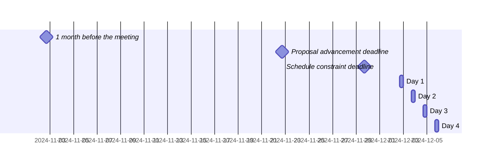

 <!-- markdownlint-disable-line MD041 -->

# Agenda for the 105th meeting of Ecma TC39

- **Host**: Remote
- **Dates and times**:
  - 10:00 to 15:00 MST (America/Denver) on 2 December 2024
  - 10:00 to 15:00 MST (America/Denver) on 3 December 2024
  - 10:00 to 15:00 MST (America/Denver) on 4 December 2024
  - 10:00 to 15:00 MST (America/Denver) on 5 December 2024
- **Location**: Albuquerque, New Mexico
- **Attendee information**: https://github.com/tc39/Reflector/issues/545
- **Total duration of scheduled discussions**: 



For meeting times in your timezone, visit [Temporal docs](https://tc39.es/proposal-temporal/docs/) and run the code below in the devtools console.

```js
Temporal.ZonedDateTime.from('2024-12-02T10:00[America/Denver]')
  .withTimeZone(Temporal.Now.timeZoneId()) // your time zone
  .toLocaleString()
```

Background:

- Allen Wirfs-Brock's [paper on standards committee participation for new attendees](http://wirfs-brock.com/allen/files/papers/standpats-asianplop2016.pdf)
- TC39's documentation on [How to participate in meetings](https://github.com/tc39/how-we-work/blob/HEAD/how-to-participate-in-meetings.md)

## Agenda topic rules

Deadline for advancement eligibility: [November 22nd, 10:00 MST](https://www.timeanddate.com/countdown/generic?p0=394&iso=20241122T10&msg=TC39%20Submission%20deadline)

- <sub>Note: this time is selected to be precisely 10 days prior to the start of the meeting</sub>

1. Proposals not looking to advance may be added at any time; if after the deadline, please always use a pull request so that members are notified of changes. Note: an unmerged PR counts as “added” for the purposes of this requirement.
1. Proposals seeking feedback at stage 0 must be added (and noted as such) prior to the deadline, or else delegates may object to advancement solely on the basis of missing the deadline.
    1. Such proposals *should* include supporting materials when possible.
1. Proposals looking to advance to stage 1 must be added (and noted as such) prior to the deadline, or else delegates may object to advancement solely on the basis of missing the deadline.
    1. Such proposals *must* link to a proposal repository and they *should* link to supporting materials when possible.
1. Proposals looking to advance to stages 2, 2.7, 3, or 4, as well as other normative changes to the standard or proposals in stage 3 or later looking to achieve consensus, must be added (and noted as such) *along with links to the supporting materials* prior to the deadline, or else delegates may withhold consensus for advancement solely on the basis of missing the deadline.
    1. If the supporting materials change substantially after the deadline, delegates may withhold consensus for advancement, based on the committee’s judgment.
    1. For urgent normative changes, the committee is expected to be more forgiving of a missed deadline, since there is generally less material to review than in a stage advancement.
    1. Proposals looking to advance to stage 4 *must* link to a pull request into [the spec](https://github.com/tc39/ecma262), since the [process](https://tc39.github.io/process-document/) requires one.
1. Proposal-based agenda items should be sorted primarily by stage (descending), secondarily by timebox (ascending), and finally by insertion date.

Supporting materials includes slides, a link to the proposal repository, a link to spec text, etc.; essentially, anything you are planning to present to the committee, or that would be useful for delegates to review.

## Agenda key

When applicable, use these emoji as a prefix to the agenda item topic.

| Emoji | Meaning                                                              |
| :---: | :---                                                                 |
|  ❄️    | hard schedule constraints apply to this agenda item (e.g. presenter) |
|  🔒   | schedule constraints apply to this agenda item                       |
|  ⌛️   | late addition for stage advancement and/or schedule prioritization   |
|  🔁   | continuation of a previous agenda item                               |

## Agenda items

1. Opening, welcome and roll call (Chair)
    1. Opening of the meeting
    1. TC39 follows its [Code of Conduct](https://tc39.github.io/code-of-conduct/)
    1. Introduction of attendees
    1. Host facilities, local logistics
    1. Quick recap of meeting IPR policy
    1. Overview of communication tools
    1. Reminder to review Github Delegate teams (Jordan Harband)
    1. [TC39 stenography support and legal disclaimer](https://github.com/tc39/Reflector/blob/main/transcriptions.md)
1. Find volunteers for note taking
1. Adoption of the agenda
1. Approval of the minutes from last meeting
1. Next meeting host and logistics
1. Secretary's Report ([slides](./tc39-2024-052-Rev1.pdf)) (15m, Samina Husain)
1. Project Editors’ Reports
    1. [ECMA262](https://github.com/tc39/ecma262) Status Updates ([slides](https://docs.google.com/presentation/d/1IS6hsFker8TM_mPtK1VQbFCH2TK3LljOxFu6-zMCjkM/edit)) (15m)
    1. [ECMA402](https://github.com/tc39/ecma402) Status Updates (15m)
    1. [ECMA404](https://www.ecma-international.org/publications/standards/Ecma-404.htm) Status Updates (15m)
    1. [Test262](https://github.com/tc39/test262) Status Updates (15m)
1. Task Group Reports
    <!-- 1. TG2: Internationalization (5m) - in practice, this is covered via the ECMA-402 project editors' report -->
    1. TG3: Security (5m)
    1. TG4: Source Maps (5m)
    1. TG5: Experiments in Programming Language Standardization (5m)
1. Updates from the [CoC Committee](https://tc39.es/code-of-conduct/#code-of-conduct-committee) (5m)
1. [Web compatibility issues](https://github.com/tc39/ecma262/issues?utf8=✓&q=is%3Aopen+label%3A%22web+reality%22+is%3Aissue) / [Needs Consensus PRs](https://github.com/tc39/ecma262/pulls?q=is%3Apr+is%3Aopen+label%3A%22needs+consensus%22)

    | timebox | topic | presenter |
    |:-------:|-------|-----------|
    | 10m     | [iterator helpers close receiver on argument validation failure](https://github.com/tc39/ecma262/pull/3467)  | Kevin Gibbons |
    | 30m     | re-using IteratorResult objects in iterator helpers ([PR](https://github.com/tc39/ecma262/pull/3489)) ([slides](https://docs.google.com/presentation/d/1HQzC15dFnQClnUWYHSFx95aMuiJjHAjE186flPW7iZE)) | Michael Ficarra |

1. Overflow from previous meeting

    | timebox | topic | presenter |
    |:-------:|-------|-----------|

1. Short (≤30m) Timeboxed Discussions

    | timebox | topic | presenter |
    |:-------:|-------|-----------|
    | 1m      | Call for reviewers - [ESM Phase Imports](https://github.com/tc39/proposal-esm-phase-imports) | Guy Bedford |
    | 10m     | Process document fixes and corrections: [#46](https://github.com/tc39/process-document/pull/46) and [#48](https://github.com/tc39/process-document/pull/48) | Chris de Almeida |
    | 10m     | The importance of supporting materials ([slides](https://docs.google.com/presentation/d/1teo8pAE4lbFTIlPZxum2MBcNZfGdUM2Y8huEiVdvQiQ/))| Daniel Minor |
    | 30m     | Briefing on the formation and goals of TC55 (or, All About Moving the WinterCG into Ecma) ([slides](https://docs.google.com/presentation/d/1WnqF7y52QlPRw737ZOTC4rdmJ65-nT9BbOD05jr2sjE/edit#slide=id.p)) | James M Snell |

1. Proposals

    | stage | timebox | topic | presenter |
    |:-----:|:-------:|-------|-----------|
    | 3     | 15m     | [Intl.DurationFormat](https://github.com/tc39/proposal-intl-duration-format) for Stage 4. ([PR](https://github.com/tc39/ecma402/pull/943)) ([slides](https://docs.google.com/presentation/d/1bAuZ0ZSSYUdJxiDYXz2tUWHZwaOmYkNoLpQBBy_qz1w/edit?usp=sharing))| Ben Allen |
    | 2.7   | 15m     | [`Error.isError`](https://github.com/tc39/proposal-is-error/issues/7) to stage 3? | Jordan Harband |
    | 2.7   | 15m     | [iterator sequencing](https://github.com/tc39/proposal-iterator-sequencing) for Stage 3 ([tests](https://github.com/tc39/test262/pull/4326)) ([slides](https://docs.google.com/presentation/d/1EHMDcnV9zJ1E7BRhKmYtzHchZvOzjWynR3W-VdNxglw)) | Michael&nbsp;Ficarra |
    | 2.7   | 40m     | [`import defer`](https://github.com/tc39/proposal-defer-import-eval/) updates ([slides](https://docs.google.com/presentation/d/1yFbqn6px5rIwAVjBbXgrYgql1L90tKPTWZq2A5D6f5Q/)) | Nicolò Ribaudo |
    | 2.7   | 60m     | [ShadowRealm](https://github.com/tc39/proposal-shadowrealm) for Stage 3 ([slides](https://ptomato.name/talks/tc39-2024-12)) | Philip Chimento |
    | 2     | 5m      | [AsyncContext](https://github.com/tc39/proposal-async-context) request for Stage 2.7 reviewers ([Slides](https://docs.google.com/presentation/d/14DxgoHhTL7tzJpcu94y70USeXT9jlkF2k6lJDI720Kc/edit?usp=sharing)) | Andreu Botella |
    | 2     | 30m     | [Upsert (formerly Map.emplace)](https://github.com/tc39/proposal-upsert) Update and request for Stage 2 reviewers ([Slides](https://docs.google.com/presentation/d/15sWTvdWIo9Jt12LFRNBPJo1N_8xsMSCB3jy73HBFX-M/))| Daniel Minor |
    | 2     | 60m     | [ESM Phase Imports](https://github.com/tc39/proposal-esm-phase-imports) for Stage 2.7 ([slides](https://docs.google.com/presentation/d/1qfnmqPkpuAqTv-1pll1Y6EkEHElf_58BtNBQSw9dpq8/edit?usp=sharing)) | Guy Bedford |
    | 1     | 30m     | [Immutable ArrayBuffer](https://github.com/tc39/proposal-immutable-arraybuffer) to stage 2 ([slides.key](https://github.com/tc39/proposal-immutable-arraybuffer/raw/refs/heads/main/immu-arraybuffer-talks/immu-arrayBuffers-stage2.key), [slides.pdf](https://github.com/tc39/proposal-immutable-arraybuffer/blob/main/immu-arraybuffer-talks/immu-arrayBuffers-stage2.pdf), [docs slides](https://docs.google.com/presentation/d/1S1ixC7AVg3s_p4ZNhu3zBMcIcKbFkmp6umnsQUKOIqw/edit?usp=sharing)) | Mark Miller |
    | 1     | 30m     | [Measure](https://github.com/tc39-transfer/proposal-measure) Stage 1 update ([slides](https://docs.google.com/presentation/d/17ypyikW1q8RFf5AnnYKpe5dsdrHTb0BnSzZGaq0mm-I/edit?usp=sharing)) | Eemeli Aro |
    | 1     | 60m     | [Error Stacks Structure](https://github.com/tc39/proposal-error-stacks) for Stage 2 | Jordan Harband |
    | 0     | 30m     | [Import Sync](https://github.com/guybedford/proposal-import-sync) discussion, request for Stage 1? ([slides](https://docs.google.com/presentation/d/1GW_OCoVjd6OJi9BKSlQzQKqxrB0GUKHKFof4s3rn9yk/edit?usp=sharing)) | Guy Bedford |
    | 0     | 30m     | [More Currency Display Choices](https://github.com/eemeli/proposal-intl-currency-display-choices) for Stage 1/2 | Eemeli Aro |
    | 0     | 60m     | [Stabilize](https://github.com/Agoric/proposal-stabilize) to stage 1 ([youtube talk](https://www.youtube.com/watch?v=VHr4Jvvt0vc), [slides.key](https://github.com/Agoric/proposal-stabilize/raw/refs/heads/main/stabilize-talks/stabilize-stage1.key), [slides.pdf](https://github.com/Agoric/proposal-stabilize/blob/main/stabilize-talks/stabilize-stage1.pdf), [docs slides](https://docs.google.com/presentation/d/1474EreKln5bErl-pMUUq2PnX5LRo2Z93jxxGBNbZmco/edit?usp=sharing)) | Mark Miller |

1. Longer or open-ended discussions

    | timebox | topic | presenter |
    |:-------:|-------|-----------|
    | 30m     | Module Harmony: where we are ([slides](https://docs.google.com/presentation/d/1V2-4Hj-HBVQwdphcJUsrbmbitOPBMSf3HhKSvhBk4d0/edit?usp=sharing)) | Nicolò Ribaudo |
    | 60m     | Vision for numeric types in ECMAScript ([slides](https://docs.google.com/presentation/d/1Uzrf-IwPrljF2BhCbCWuwQxlgGSm_bcd3FRbPO3Yrio/edit#slide=id.p)) | Shane F. Carr |

1. Overflow from timeboxed agenda items (in insertion order)

    | topic | presenter |
    |-------|-----------|

1. Incubation call chartering (15m on the last day)

1. Other business
    1. Thank host
1. Adjournment

### Schedule constraints

*Schedule constraints should be supplied here as soon as possible, and **at least three days** before the meeting begins so that the Chairs can take them into account when preparing the schedule.*

<!-- DO NOT PUT YOUR CONSTRAINTS HERE! Put them in one of the next sections: either "Normal Constraints" or "Late-breaking Schedule Constraints" -->

<!-- Be specific! Provide a full name, date and time range that they will or will not be available, and which sessions they are trying to prioritize. Satisfaction not guaranteed, but more information is useful. Conflicting constraints honored on a first-come, first served basis. -->

#### Normal Constraints

<!-- Constraints supplied more than three days before the meeting should go here -->

- Mark Miller: Monday 2 December will be hard for me to attend (due to travel). So at least my presentations will need to be elsewhen. I will be at all of the other days.
  - Would be good for my "Stabilize" to precede Nicolò's "import defer". (Already briefly discussed with Nicolo)
  - In decreasing priority order, I would like to be able to attend, so prefer any day other than Monday:
    - Module Harmony
    - Error Stack Structure
    - ShadowRealm
    - import defer
    - re-using Iterator Result objects
    - ESM Phase Sync
    - TC55 (moving WinterCG)
- MF: the IteratorResult needs-consensus PR should be discussed before (though not necessarily immediately before) iterator sequencing Stage 3 advancement
- Guy Bedford is unavailable the morning of December 3.
- Shane Carr has personal family vacation on December 2-4 and would therefore prefer to present Vision for Numeric Types on December 5.
- Matthew Gaudet would like to attend Error Stacks; 1-3pm is the best range for the duration of the meeting.
- The Measure Stage 1 Update should be discussed after (though not necessarily immediately after) the Vision for numeric types in ECMAScript.

#### Late-breaking Schedule Constraints

<!-- Constraints supplied less than three days before the meeting should go here -->

- Not super imortant, but if there is a choice it'd be great to have the "Module harmony" presentation before the other module presentations, as it gives a very high level overview.
