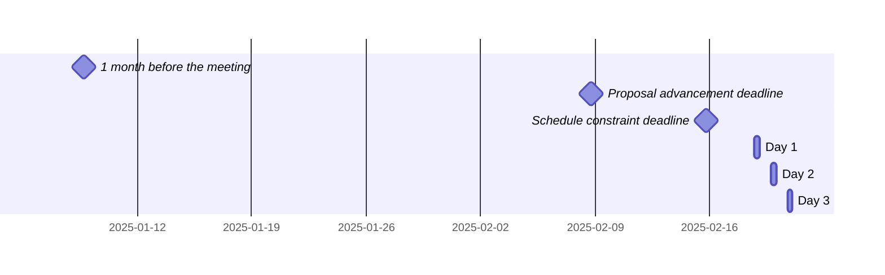

 <!-- markdownlint-disable-line MD041 -->

# Agenda for the 106th meeting of Ecma TC39

- **Host**: F5
- **Dates and times**:
  - 10:00 to 17:00 PST (America/Los_Angeles) on 18 February 2025
  - 10:00 to 17:00 PST (America/Los_Angeles) on 19 February 2025
  - 10:00 to 16:00 PST (America/Los_Angeles) on 20 February 2025
- **Location**: Seattle, WA
- **Attendee information**: https://github.com/tc39/Reflector/issues/547
- **Total duration of scheduled discussions**: 



For meeting times in your timezone, visit [Temporal docs](https://tc39.es/proposal-temporal/docs/) and run the code below in the devtools console.

```js
Temporal.ZonedDateTime.from('2025-02-18T10:00[America/Los_Angeles]')
  .withTimeZone(Temporal.Now.timeZoneId()) // your time zone
  .toLocaleString()
```

Background:

- Allen Wirfs-Brock's [paper on standards committee participation for new attendees](http://wirfs-brock.com/allen/files/papers/standpats-asianplop2016.pdf)
- TC39's documentation on [How to participate in meetings](https://github.com/tc39/how-we-work/blob/HEAD/how-to-participate-in-meetings.md)

## Agenda topic rules

Deadline for advancement eligibility: [February 8th, 10:00 PST](https://www.timeanddate.com/countdown/generic?p0=1440&iso=20250208T18&msg=TC39%20Submission%20deadline)

- <sub>Note: this time is selected to be precisely 10 days prior to the start of the meeting</sub>

1. Proposals not looking to advance may be added at any time; if after the deadline, please always use a pull request so that members are notified of changes. Note: an unmerged PR counts as “added” for the purposes of this requirement.
1. Proposals seeking feedback at stage 0 must be added (and noted as such) prior to the deadline, or else delegates may object to advancement solely on the basis of missing the deadline.
    1. Such proposals *should* include supporting materials when possible.
1. Proposals looking to advance to stage 1 must be added (and noted as such) prior to the deadline, or else delegates may object to advancement solely on the basis of missing the deadline.
    1. Such proposals *must* link to a proposal repository and they *should* link to supporting materials when possible.
1. Proposals looking to advance to stages 2, 2.7, 3, or 4, as well as other normative changes to the standard or proposals in stage 3 or later looking to achieve consensus, must be added (and noted as such) *along with links to the supporting materials* prior to the deadline, or else delegates may withhold consensus for advancement solely on the basis of missing the deadline.
    1. If the supporting materials change substantially after the deadline, delegates may withhold consensus for advancement, based on the committee’s judgment.
    1. For urgent normative changes, the committee is expected to be more forgiving of a missed deadline, since there is generally less material to review than in a stage advancement.
    1. Proposals looking to advance to stage 4 *must* link to a pull request into [the spec](https://github.com/tc39/ecma262), since the [process](https://tc39.github.io/process-document/) requires one.
1. Proposal-based agenda items should be sorted primarily by stage (descending), secondarily by timebox (ascending), and finally by insertion date.

Supporting materials includes slides, a link to the proposal repository, a link to spec text, etc.; essentially, anything you are planning to present to the committee, or that would be useful for delegates to review.

## Agenda key

When applicable, use these emoji as a prefix to the agenda item topic.

| Emoji | Meaning                                                              |
| :---: | :---                                                                 |
|  ❄️    | hard schedule constraints apply to this agenda item (e.g. presenter) |
|  🔒   | schedule constraints apply to this agenda item                       |
|  ⌛️   | late addition for stage advancement and/or schedule prioritization   |
|  🔁   | continuation of a previous agenda item                               |

## Agenda items

1. Opening, welcome and roll call (Chair)
    1. Opening of the meeting
    1. TC39 follows its [Code of Conduct](https://tc39.github.io/code-of-conduct/)
    1. Introduction of attendees
    1. Host facilities, local logistics
    1. Quick recap of meeting IPR policy
    1. Overview of communication tools
    1. Reminder to review Github Delegate teams (Jordan Harband)
    1. [TC39 stenography support and legal disclaimer](https://github.com/tc39/Reflector/blob/main/transcriptions.md)
1. Find volunteers for note taking
1. Adoption of the agenda
1. Approval of the minutes from last meeting
1. Next meeting host and logistics
1. Secretary's Report (15m, Samina Husain) ([slides](./tc39-2025-005.pdf))
1. Election of the 2025 [Chair Group](https://github.com/tc39/Reflector/issues/548), Editors, and Convenors (15m, Aki Rose Braun)
1. Project Editors’ Reports
    1. [ECMA262](https://github.com/tc39/ecma262) Status Updates ([slides](https://docs.google.com/presentation/d/1jgEaNaq6W7hZSKQILZ1F2sC1jTjRKwwnuqCGgi6iyQc/edit?usp=sharing)) (15m)
        1. NOTE: The 2025 edition will be frozen at the end of this meeting and the IPR opt-out will begin.  
    1. [ECMA402](https://github.com/tc39/ecma402) ([slides](https://notes.igalia.com/p/q98gbOaS6)) Status Updates (15m)
    1. [ECMA404](https://www.ecma-international.org/publications/standards/Ecma-404.htm) Status Updates (15m)
    1. [Test262](https://github.com/tc39/test262) Status Updates (15m)
1. Task Group Reports
    <!-- 1. TG2: Internationalization (5m) - in practice, this is covered via the ECMA-402 project editors' report -->
    1. TG3: Security (5m)
    1. TG4: Source Maps (5m) ([slides](https://docs.google.com/presentation/d/1-suKLKywflKUDzTqVBxl-dEI2bJSfG5dl205BRtVCK4/edit?usp=sharing))
    1. TG5: Experiments in Programming Language Standardization (5m)
1. Updates from the [CoC Committee](https://tc39.es/code-of-conduct/#code-of-conduct-committee) (5m)
1. [Web compatibility issues](https://github.com/tc39/ecma262/issues?utf8=✓&q=is%3Aopen+label%3A%22web+reality%22+is%3Aissue) / [Needs Consensus PRs](https://github.com/tc39/ecma262/pulls?q=is%3Apr+is%3Aopen+label%3A%22needs+consensus%22)

    | timebox | topic | presenter |
    |:-------:|-------|-----------|
    | 15m     | [Don't call well-known Symbol methods for `RegExp` on primitive values](https://github.com/tc39/ecma262/pull/3009) | Gus Caplan, Luca Casonato |

1. Overflow from previous meeting

    | timebox | topic | presenter |
    |:-------:|-------|-----------|

1. Short (≤30m) Timeboxed Discussions

    | timebox | topic | presenter |
    |:-------:|-------|-----------|

1. Proposals

    | stage | timebox | topic | presenter |
    |:-----:|:-------:|-------|-----------|
    |   3   | 5m       | [Float16Array](https://github.com/tc39/proposal-float16array) for stage 4 ([spec PR](https://github.com/tc39/ecma262/pull/3532)) | Kevin Gibbons |
    |   3   | 10m      | [Explicit Resource Management](https://github.com/tc39/proposal-explicit-resource-management) Needs Consensus PR ([PR](https://github.com/rbuckton/ecma262/pull/13)) | Ron Buckton |
    |   3   | 15m     | [Redeclarable global eval vars](https://github.com/tc39/proposal-redeclarable-global-eval-vars) for [stage 4](https://github.com/tc39/proposal-redeclarable-global-eval-vars/issues/3) ([spec PR](https://github.com/tc39/ecma262/pull/3226)) | Shu-yu Guo |
    |   3   | 15m     | [RegExp Escaping](https://github.com/tc39/proposal-regex-escaping/issues/58) for stage 4 ([spec PR](https://github.com/tc39/ecma262/pull/3382)) | Jordan Harband |
    |   3   | 20m     | [Temporal](https://github.com/tc39/proposal-temporal) normative [PR](https://github.com/tc39/proposal-temporal/pull/3054) and status update ([slides](http://ptomato.name/talks/tc39-2025-02/#8)) | Philip Chimento |
    |   3   | 30m     | [Intl Locale Info API](https://github.com/tc39/proposal-intl-locale-info) Update in Stage 3 ([PR](https://github.com/tc39/ecma402/pull/942), [slide](https://docs.google.com/presentation/d/14ColNEWDFlAnPGW6GSPSk6gbcdTmSy4pYuYXOwDlZX8)) | Frank Yung-Fong Tang |
    |   3   | 30m     | [Decorators](https://github.com/tc39/proposal-decorators) implementation updates ([slides](https://slides.com/pzuraq/decorators-for-stage-3-2022-03-977778)) | Kristen Hewell Garrett |
    |  2.7  | 10m     | [ShadowRealm](https://github.com/tc39/proposal-shadowrealm) status update ([slides](http://ptomato.name/talks/tc39-2025-02/#1)) | Philip Chimento |
    |  2.7  | 15m     | [import defer](https://github.com/tc39/proposal-defer-import-eval/) for Stage 3 (tests: all PRs linked to https://github.com/tc39/test262/issues/4215, [slides](https://docs.google.com/presentation/d/1LjsJhdTIP3wgo1odtVa-qbfyGU5M1W9YMm0AtKnJJKk/edit?usp=sharing)) | Nicolò Ribaudo |
    |   2   | 30m     | [Immutable ArrayBuffer](https://github.com/tc39/proposal-immutable-arraybuffer) for stage 2.7 | Mark Miller |
    |   2   | 45m     | [Records & Tuples](https://github.com/tc39/proposal-record-tuple) future directions [slides](https://docs.google.com/presentation/d/1uONn7T91lfZDV4frCsxpwd1QB_pU3P7F6V2j9jEPnA8/) | Ashley Claymore |
    |   1   | 30m     | [Limited ArrayBuffer](https://github.com/tc39/proposal-limited-arraybuffer) update: stay on stage 1 or withdraw?, [slides](https://docs.google.com/presentation/d/1u6JsSeInvm6F4OrmCSLubtDvFVdjw1ESeE5-c_YflHE/) | Jack Works |
    |   1   | 30m     | [Stabilize integrity traits](https://github.com/tc39/proposal-stabilize) status update | Mark Miller |
    |   1   | 60m     | A unified vision for [measure](https://github.com/tc39/proposal-measure/) and [decimal](https://github.com/tc39/proposal-decimal/) ([slides](https://notes.igalia.com/p/tc39-2025-02-plenary-decimal-measure-unity)) | Jesse Alama and Eemeli Aro |
    |   1   | 60m     | [Stable Formatting](https://github.com/tc39/proposal-stable-formatting) update ([PR](https://github.com/tc39/proposal-stable-formatting/pull/18), [slides](https://docs.google.com/presentation/d/14KQA1Gyy0reIyouHtzp5ofYRrcwRjkY6GajeknLWhg0/edit?usp=sharing)) | Eemeli Aro |
    |   0   | 30m     | [Error Stack Accessor](https://github.com/ljharb/proposal-error-stack-accessor) for stage 1 or 2 | Jordan Harband |
    |   0   | 30m     | [`Math.clamp`](https://github.com/CanadaHonk/proposal-math-clamp) for Stage 1 or 2 | Oliver Medhurst |
    |   0   | 30m     | [`Error.captureStackTrace`](https://github.com/mgaudet/proposal-error-capturestacktrace) [(slides)](https://docs.google.com/presentation/d/1SFdS9n5JR7Jqz29s7ApvkqDOqOfPW-IaBR2orK828As/edit?usp=sharing) for Stage 1 | Matthew Gaudet |
    |   0   | 30m     | [Curtailing the power of "Thenables"](https://github.com/mgaudet/proposal-thennable-curtailment) [(Slides)](https://docs.google.com/presentation/d/1Sny2xC5ZvZPuaDw3TwqOM4mj7W6NZmR-6AMdpskBE-M/edit#slide=id.p) for Stage 1 | Matthew Gaudet |
    |   0   | 30m     | [`Number.isSafeNumeric`](https://github.com/Lxxyx/proposal-number-is-safe-numeric) [(slides)](https://docs.google.com/presentation/d/1Noxi5L0jnikYce1h7X67FnjMUbkBQAcMDNafkM7bF4A/edit?usp=sharing) for Stage 1 | ZiJian Liu |
1. Longer or open-ended discussions

    | timebox | topic | presenter |
    |:-------:|-------|-----------|
    | 45m     | [Decision Making through Consensus - take 2](https://github.com/msaboff/tc39/blob/master/TC39%20Consensus%20take%202.pdf) | Michael Saboff |
    | 60m (fine to be shorter) | Language design goal for consensus: Things should layer ([slides](https://docs.google.com/presentation/d/1Nj6E1h0SeyDGI3e8BQlATQeX-l6x4Jx7uGAM8XimfIM/edit#slide=id.g329dc435965_0_344)) | Daniel Ehrenberg |

1. Overflow from timeboxed agenda items (in insertion order)

    | topic | presenter |
    |-------|-----------|

1. Incubation call chartering (15m on the last day)

1. Other business
    1. Thank host
1. Adjournment

### Schedule constraints

*Schedule constraints should be supplied here as soon as possible, and **at least three days** before the meeting begins so that the Chairs can take them into account when preparing the schedule.*

<!-- DO NOT PUT YOUR CONSTRAINTS HERE! Put them in one of the next sections: either "Normal Constraints" or "Late-breaking Schedule Constraints" -->

<!-- Be specific! Provide a full name, date and time range that they will or will not be available, and which sessions they are trying to prioritize. Satisfaction not guaranteed, but more information is useful. Conflicting constraints honored on a first-come, first served basis. -->

#### Normal Constraints

<!-- Constraints supplied more than three days before the meeting should go here -->

- Ron Buckton will not be available from 11:30pm to ~12:30pm on each day.
- Kristen Hewell Garrett will not be available on Wednesday, Feb 19th until 14:00 PST
- Matthew Gaudet will be unavailable the afternoon of Thursday Feb 20th.
- Matthew Gaudet would prefer Error.captureStackTrace, Curtailing the power of "thenables", and Error Stack Accessor happen between 12:00 and 3:00 PST
- Eemeli Aro will be unavailable during the afternoons of each day, and would like to attend the "unified vision for measure and decimal" discussion.
- Philip Chimento: mild preference to present ShadowRealm and Temporal back to back, if possible.
- ZiJian Liu: hope to schedule `Number.isSafeNumeric` during the last two hours of the first and second days(15:00 - 17:00 PST), or the last hour of the final day(15:00 - 16:00 PST).
- Waldemar would like to attend Records & Tuples and Measure/Decimal but will not be available on Thursday Feb 20.

#### Late-breaking Schedule Constraints

<!-- Constraints supplied less than three days before the meeting should go here -->
- Ron Buckton needs to be present during the Decorators presentation.
