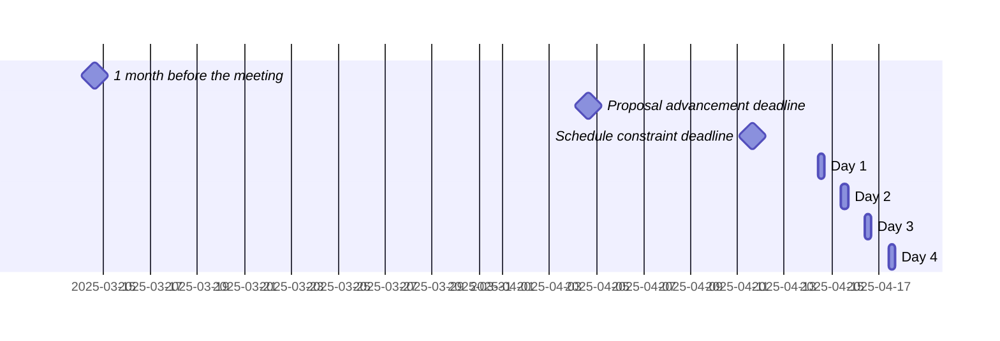

 <!-- markdownlint-disable-line MD041 -->

# Agenda for the 107th meeting of Ecma TC39

- **Host**: TBD
- **Dates and times**:
  - 10:00 to 15:00 EDT (America/New_York) on 14 April 2025
  - 10:00 to 15:00 EDT (America/New_York) on 15 April 2025
  - 10:00 to 15:00 EDT (America/New_York) on 16 April 2025
  - 10:00 to 15:00 EDT (America/New_York) on 17 April 2025
- **Location**: Remote
- **Attendee information**: https://github.com/tc39/Reflector/issues/554
- **Total duration of scheduled discussions**: 



For meeting times in your timezone, visit [Temporal docs](https://tc39.es/proposal-temporal/docs/) and run the code below in the devtools console.

```js
Temporal.ZonedDateTime.from('2025-04-14T10:00[America/New_York]')
  .withTimeZone(Temporal.Now.timeZoneId()) // your time zone
  .toLocaleString()
```

Background:

- Allen Wirfs-Brock's [paper on standards committee participation for new attendees](http://wirfs-brock.com/allen/files/papers/standpats-asianplop2016.pdf)
- TC39's documentation on [How to participate in meetings](https://github.com/tc39/how-we-work/blob/HEAD/how-to-participate-in-meetings.md)

## Agenda topic rules

Deadline for advancement eligibility: [April 4th, 10:00 EDT](https://www.timeanddate.com/countdown/generic?p0=179&iso=20250404T10&msg=TC39%20Submission%20deadline)

- <sub>Note: this time is selected to be precisely 10 days prior to the start of the meeting</sub>

1. Proposals not looking to advance may be added at any time; if after the deadline, please always use a pull request so that members are notified of changes. Note: an unmerged PR counts as “added” for the purposes of this requirement.
1. Proposals seeking feedback at stage 0 must be added (and noted as such) prior to the deadline, or else delegates may object to advancement solely on the basis of missing the deadline.
    1. Such proposals *should* include supporting materials when possible.
1. Proposals looking to advance to stage 1 must be added (and noted as such) prior to the deadline, or else delegates may object to advancement solely on the basis of missing the deadline.
    1. Such proposals *must* link to a proposal repository and they *should* link to supporting materials when possible.
1. Proposals looking to advance to stages 2, 2.7, 3, or 4, as well as other normative changes to the standard or proposals in stage 3 or later looking to achieve consensus, must be added (and noted as such) *along with links to the supporting materials* prior to the deadline, or else delegates may withhold consensus for advancement solely on the basis of missing the deadline.
    1. If the supporting materials change substantially after the deadline, delegates may withhold consensus for advancement, based on the committee’s judgment.
    1. For urgent normative changes, the committee is expected to be more forgiving of a missed deadline, since there is generally less material to review than in a stage advancement.
    1. Proposals looking to advance to stage 4 *must* link to a pull request into [the spec](https://github.com/tc39/ecma262), since the [process](https://tc39.github.io/process-document/) requires one.
1. Proposal-based agenda items should be sorted primarily by stage (descending), secondarily by timebox (ascending), and finally by insertion date.

Supporting materials includes slides, a link to the proposal repository, a link to spec text, etc.; essentially, anything you are planning to present to the committee, or that would be useful for delegates to review.

## Agenda key

When applicable, use these emoji as a prefix to the agenda item topic.

| Emoji | Meaning                                                              |
| :---: | :---                                                                 |
|  ❄️    | hard schedule constraints apply to this agenda item (e.g. presenter) |
|  🔒   | schedule constraints apply to this agenda item                       |
|  ⌛️   | late addition for stage advancement and/or schedule prioritization   |
|  🔁   | continuation of a previous agenda item                               |

## Agenda items

1. Opening, welcome and roll call (Chair)
    1. Opening of the meeting
    1. TC39 follows its [Code of Conduct](https://tc39.github.io/code-of-conduct/)
    1. Introduction of attendees
    1. Host facilities, local logistics
    1. Quick recap of meeting IPR policy
    1. Overview of communication tools
    1. Reminder to review Github Delegate teams (Jordan Harband)
    1. [TC39 stenography support and legal disclaimer](https://github.com/tc39/Reflector/blob/main/transcriptions.md)
1. Find volunteers for note taking
1. Adoption of the agenda
1. Approval of the minutes from last meeting
1. Next meeting host and logistics
1. Secretary's Report (15m, Samina Husain) ([slides](./tc39-2025-013.pdf))
1. Project Editors’ Reports
    1. [ECMA262](https://github.com/tc39/ecma262) Status Updates ([slides](https://docs.google.com/presentation/d/1nMm5zShUP86JZie3eRx_7Q7sQhxUf30wVShcgyyI6yM/edit?usp=sharing)) (15m)
    1. [ECMA402](https://github.com/tc39/ecma402) Status Updates ([slides](https://notes.igalia.com/p/3659fVyEC)) (15m)
    1. [ECMA404](https://www.ecma-international.org/publications/standards/Ecma-404.htm) Status Updates (15m)
    1. [Test262](https://github.com/tc39/test262) Status Updates (15m)
1. Task Group Reports
    <!-- 1. TG2: Internationalization (5m) - in practice, this is covered via the ECMA-402 project editors' report -->
    1. TG3: Security (5m)
    1. TG4: Source Maps ([slides](https://docs.google.com/presentation/d/12LqxqhbA006bDruaTle-FOjD8L_DqD9Q_L8GqL0O_Lg/edit?usp=sharing)) (5m)
    1. TG5: Experiments in Programming Language Standardization (5m)
1. Updates from the [CoC Committee](https://tc39.es/code-of-conduct/#code-of-conduct-committee) (5m)
1. [Web compatibility issues](https://github.com/tc39/ecma262/issues?utf8=✓&q=is%3Aopen+label%3A%22web+reality%22+is%3Aissue) / [Needs Consensus PRs](https://github.com/tc39/ecma262/pulls?q=is%3Apr+is%3Aopen+label%3A%22needs+consensus%22)

    | timebox | topic | presenter |
    |:-------:|-------|-----------|
    | 5m | Normative: add notation to PluralRules (ecma402[#989](https://github.com/tc39/ecma402/pull/989), [slides](https://notes.igalia.com/p/UpmK0K8eo)) | Ujjwal Sharma |
    | 10m | Normative: Mark sync module evaluation promise as handled ([#3535](https://github.com/tc39/ecma262/pull/3535), [slides](https://docs.google.com/presentation/d/1kheOg1AZDj-T9n0O-0sbd5IBwvnjiODyJcK1Ez6Q0JU)) | Nicolò Ribaudo |

1. Overflow from previous meeting

    | timebox | topic | presenter |
    |:-------:|-------|-----------|

1. Short (≤30m) Timeboxed Discussions

    | timebox | topic | presenter |
    |:-------:|-------|-----------|

1. Proposals

    | stage | timebox | topic | presenter |
    |:-----:|:-------:|-------|-----------|
    |   3   | 5m      | [Note about changed behavior of Array.fromAsync](https://github.com/tc39/proposal-array-from-async/issues/39#issuecomment-1526744932) after landing [#2600](https://github.com/tc39/ecma262/pull/2600) | Kevin Gibbons |
    |   3   | 10m     | [Temporal](https://github.com/tc39/proposal-temporal) status update ([slides](https://ptomato.name/talks/tc39-2025-04/#1)) | Philip Chimento |
    |   3   | 30m     | [Explicit Resource Management](https://github.com/tc39/proposal-explicit-resource-management) implementer feedback  ([slides](https://docs.google.com/presentation/d/1F4kLwEUvBmyyTWq06HQgiJypcCWm3uwOzVDzFQ0xauE/)) | Daniel Minor |
    |   2.7 | 30m     | [Immutable ArrayBuffer](https://github.com/tc39/proposal-immutable-arraybuffer) for stage 3 ([keynote slides](https://github.com/tc39/proposal-immutable-arraybuffer/blob/main/immu-arraybuffer-talks/immu-arrayBuffers-stage3.key), [pdf slides](https://github.com/tc39/proposal-immutable-arraybuffer/blob/main/immu-arraybuffer-talks/immu-arrayBuffers-stage3.pdf))  | Mark Miller, Peter Hoddie |
    |   2   | 15m     | ⌛️ Withdrawing [Record & Tuples](https://github.com/tc39/proposal-record-tuple) ([slides](https://docs.google.com/presentation/d/1afxyqJthBWsOpBvmPFP-VOhT8KyVF_AQlXLj0nkY6v4/)) | Ashley Claymore |
    |   2   | 30m     | [Upsert](https://github.com/tc39/proposal-upsert) for stage 2.7  ([slides](https://docs.google.com/presentation/d/1Mfc7jl2Rbe8K8LCJWtjNZS94tQpzgvQIBfrq2e_iRcU/)) | Daniel Minor |
    |   2   | 30m     | [Intl Era Month Code](https://github.com/tc39/proposal-intl-era-monthcode) Stage 2 Update | Shane F Carr |
    |   2   | 45m     | [AsyncContext](https://github.com/tc39/proposal-async-context) Stage 2 [Update](https://github.com/tc39/proposal-async-context/blob/master/FRAMEWORKS.md) ([slides](https://docs.google.com/presentation/d/1YkSQIWxCQCLSe1WKFWpndEd-gdf9coE1HRYa_v_z5J0/)) | Andreu Botella, Chengzhong Wu, Nicolò Ribaudo |
    |   1   | 60m     | [Don't Remember Panicking](https://github.com/tc39/proposal-oom-fails-fast/tree/master) stage 1 Update ([keynote slides](https://github.com/tc39/proposal-oom-fails-fast/blob/master/panic-talks/dont-remember-panicking.key), [pdf slides](https://github.com/tc39/proposal-oom-fails-fast/blob/master/panic-talks/dont-remember-panicking.pdf)) | Mark Miller, Peter Hoddie |
    |   1   | 60m     | Stage 1 update for [decimal](https://github.com/tc39/proposal-decimal) & [measure](https://github.com/tc39/proposal-measure): Amounts ([slides](https://notes.igalia.com/p/tc39-2025-04-decimal-intl-integration)) | Jesse Alama |
    |   0   | 30m     | [Non-extensible Applies to Private](https://github.com/syg/proposal-nonextensible-applies-to-private) for stage 1, 2, or 2.7 ([keynote slides](https://github.com/syg/proposal-nonextensible-applies-to-private/blob/main/no-stamping-talks/non-extensible-applies-to-private.key), [pdf slides](https://github.com/syg/proposal-nonextensible-applies-to-private/blob/main/no-stamping-talks/non-extensible-applies-to-private.pdf)) | Mark Miller, Shu-yu Guo |
    |   0   | 30m     | [Compare Strings by Codepoint](https://github.com/endojs/proposal-compare-strings-by-codepoint) for stage 1 or 2 (slides coming) | Mathieu Hofman, Mark Miller |
    |   0   | 30m     | [`Object.propertyCount`](https://github.com/ljharb/object-property-count) for stage 1 or 2 | Jordan Harband |
    | 0 / 2 | 30m     | [`export defer`](https://github.com/nicolo-ribaudo/proposal-deferred-reexports) extracted from `import defer`: stage 2 update or for stage 1 ([slides](https://docs.google.com/presentation/d/1ats5CbsgalobhnfFIR2b1QAdaLRe4yVI55meo_ARqdU)) | Nicolò Ribaudo |
    |   0   | 60m     | Composite Keys for stage 1 ([repo](https://github.com/acutmore/proposal-composites), [slides](https://docs.google.com/presentation/d/1n7lj_y02f4QjrTMvRGs3aZXt_zji5nSVYGhmVchMpvI/)) | Ashley Claymore |
    |   0   | 60m     | Enums for Stage 1 ([explainer](https://github.com/rbuckton/proposal-enum), [slides](https://1drv.ms/p/c/934f1675ed4c1638/EYypvengQohMlG52w1qseW8BCwCkSG0Y-2ip8Zq7pxoOFw?e=Aklyqu)) | Ron Buckton |
    |   0   | 60m     | [Disposable AsyncContext](https://github.com/legendecas/proposal-async-context-disposable) for Stage 1 ([slides](https://docs.google.com/presentation/d/1p_rQ5UagJ3Bgwbds0NL-nBaR3ovJLmyHmKuRMJejs_Y/edit?usp=sharing)) | Chengzhong Wu, Luca Casonato, snek |
    |  N/A  | 30m     | [WHATWG Observables](https://github.com/WICG/observable) for general TC39 feedback ([slides](https://docs.google.com/presentation/d/1i5_zneksrU7i7ZHcl5EQRzUHGkmXRIQKd-bLfrPRNXY/edit?usp=sharing)) | Dominic Farolino|

1. Longer or open-ended discussions

    | timebox | topic | presenter |
    |:-------:|-------|-----------|
    | 30m     | Guidelines for Locale-Sensitive Testing in Test262 ([slides](https://ptomato.name/talks/tc39-2025-04/#8)) | Philip Chimento |
    | 60m     | Update to Consensus policy ([slides](https://github.com/msaboff/tc39/blob/master/TC39%20Consensus%20Apr%202025.pdf)) | Michael Saboff |

1. Overflow from timeboxed agenda items (in insertion order)

    | topic | presenter |
    |-------|-----------|

1. Incubation call chartering (15m on the last day)

1. Other business
    1. Thank host
1. Adjournment

### Schedule constraints

*Schedule constraints should be supplied here as soon as possible, and **at least three days** before the meeting begins so that the Chairs can take them into account when preparing the schedule.*

<!-- DO NOT PUT YOUR CONSTRAINTS HERE! Put them in one of the next sections: either "Normal Constraints" or "Late-breaking Schedule Constraints" -->

<!-- Be specific! Provide a full name, date and time range that they will or will not be available, and which sessions they are trying to prioritize. Satisfaction not guaranteed, but more information is useful. Conflicting constraints honored on a first-come, first served basis. -->

#### Normal Constraints

<!-- Constraints supplied more than three days before the meeting should go here -->
- Jordan Harband will not be present for the first 2 hours of each day, and the last hour of days 1, 3, and 4, and would like to be present for the following items: Consensus, Object.propertyCount, Non-extensibile Applies to Private, Compare Strings By Codepoint, Composite Keys, Upsert, Enums, Immutable ArrayBuffer, export defer
- Nicolò Ribaudo will not be available on the second day. Other than for my presentations, I'd like to be present (in order of priority, Decimal is the only one I strongly care about) for Decimal, AsyncContext (both presentations) Composite keys, enums.
- Luca Casonato will not be available on the second day. I need to be present for Disposable AsyncContext.Variable, and would like to be present for composite keys.
- Steve Hicks will not be available after 11am on day 4, and I'd like to participate in the two AsyncContext discussions.
- Ron Buckton will not be available after 2:30pm on days 1 and 2 and needs to be present for "Explicit Resource Management implementer feedback" and "Disposable AsyncContext" in addition to his own topic.
- Philip Chimento: Feel free to deprioritize "Guidelines for Locale-Sensitive Testing in Test262" if time is short.
- Shane F Carr would like to attend the following topics: Intl Era Month Code (required), Decimal (required), Compare Strings by Codepoint (required), Guidelines for Locale-Sensitive Testing in Test262 (required), Composite Keys (optional). He is *not* available at the following times (all in EDT): Monday after 12pm (other meetings); Tuesday (traveling); Thursday after 11:30am (commute and other meetings).
- The AsyncContext stage 2 presentation should be before the Disposable AsyncContext one, not necessarily back-to-back.
- 'Withdrawing Records & Tuples' should be after 'Composite Keys for Stage 1'
- ❄️  Dominic Farolino can present Observables on any of the following: Tuesday, 10:00–13:00 EDT; Wednesday, 10:00–12:00 EDT; Thursday, 10:00–13:00 EDT.

#### Late-breaking Schedule Constraints

<!-- Constraints supplied less than three days before the meeting should go here -->

- Philip Chimento: I will not be available for the last 30 minutes of Wednesday 16 April.
- Aki Rose Braun: I will be unavailable the last hour of Monday and the second half of Wednesday. I have a strong preference to be present for the Consensus discussion.
