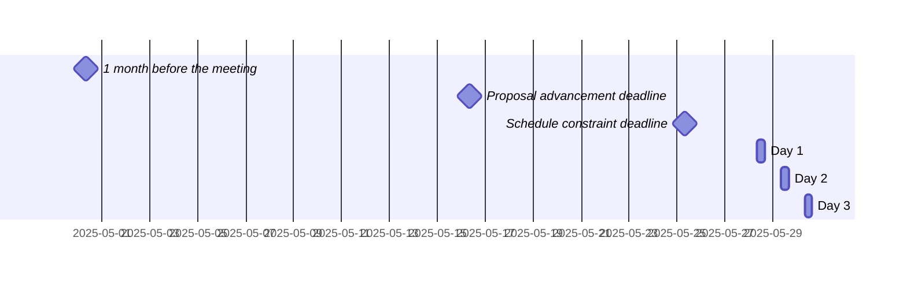

 <!-- markdownlint-disable-line MD041 -->

# Agenda for the 108th meeting of Ecma TC39

- **Host**: Igalia
- **Dates and times**:
  - 10:00 to 17:00 TZ (Europe/Madrid) on 28 May 2025
  - 10:00 to 17:00 TZ (Europe/Madrid) on 29 May 2025
  - 10:00 to 16:00 TZ (Europe/Madrid) on 30 May 2025
- **Location**: A Coruña, Galicia
- **Attendee information**: https://github.com/tc39/Reflector/issues/558
- **Total duration of scheduled discussions**: 



For meeting times in your timezone, visit [Temporal docs](https://tc39.es/proposal-temporal/docs/) and run the code below in the devtools console.

```js
Temporal.ZonedDateTime.from('2025-05-28T10:00[Europe/Madrid]')
  .withTimeZone(Temporal.Now.timeZoneId()) // your time zone
  .toLocaleString()
```

Background:

- Allen Wirfs-Brock's [paper on standards committee participation for new attendees](http://wirfs-brock.com/allen/files/papers/standpats-asianplop2016.pdf)
- TC39's documentation on [How to participate in meetings](https://github.com/tc39/how-we-work/blob/HEAD/how-to-participate-in-meetings.md)

## Agenda topic rules

Deadline for advancement eligibility: [May 16th 10:00 CEST](https://www.timeanddate.com/countdown/generic?iso=20250516T10&p0=681&csz=1&msg=TC39%20Submission%20deadline)

- <sub>Note: this time is selected to be precisely 10 days prior to the start of the meeting</sub>

1. Proposals not looking to advance may be added at any time; if after the deadline, please always use a pull request so that members are notified of changes. Note: an unmerged PR counts as “added” for the purposes of this requirement.
1. Proposals seeking feedback at stage 0 must be added (and noted as such) prior to the deadline, or else delegates may object to advancement solely on the basis of missing the deadline.
    1. Such proposals *should* include supporting materials when possible.
1. Proposals looking to advance to stage 1 must be added (and noted as such) prior to the deadline, or else delegates may object to advancement solely on the basis of missing the deadline.
    1. Such proposals *must* link to a proposal repository and they *should* link to supporting materials when possible.
1. Proposals looking to advance to stages 2, 2.7, 3, or 4, as well as other normative changes to the standard or proposals in stage 3 or later looking to achieve consensus, must be added (and noted as such) *along with links to the supporting materials* prior to the deadline, or else delegates may withhold consensus for advancement solely on the basis of missing the deadline.
    1. If the supporting materials change substantially after the deadline, delegates may withhold consensus for advancement, based on the committee’s judgment.
    1. For urgent normative changes, the committee is expected to be more forgiving of a missed deadline, since there is generally less material to review than in a stage advancement.
    1. Proposals looking to advance to stage 4 *must* link to a pull request into [the spec](https://github.com/tc39/ecma262), since the [process](https://tc39.github.io/process-document/) requires one.
1. Proposal-based agenda items should be sorted primarily by stage (descending), secondarily by timebox (ascending), and finally by insertion date.

Supporting materials includes slides, a link to the proposal repository, a link to spec text, etc.; essentially, anything you are planning to present to the committee, or that would be useful for delegates to review.

## Agenda key

When applicable, use these emoji as a prefix to the agenda item topic.

| Emoji | Meaning                                                              |
| :---: | :---                                                                 |
|  ❄️    | hard schedule constraints apply to this agenda item (e.g. presenter) |
|  🔒   | schedule constraints apply to this agenda item                       |
|  ⌛️   | late addition for stage advancement and/or schedule prioritization   |
|  🔁   | continuation of a previous agenda item                               |

## Agenda items

1. Opening, welcome and roll call (Chair)
    1. Opening of the meeting
    1. TC39 follows its [Code of Conduct](https://tc39.github.io/code-of-conduct/)
    1. Introduction of attendees
    1. Host facilities, local logistics
    1. Quick recap of meeting IPR policy
    1. Overview of communication tools
    1. Reminder to review Github Delegate teams (Jordan Harband)
    1. [TC39 stenography support and legal disclaimer](https://github.com/tc39/Reflector/blob/main/transcriptions.md)
1. Find volunteers for note taking
1. Adoption of the agenda
1. Approval of the minutes from last meeting
1. Next meeting host and logistics
1. Secretary's Report (15m, Samina Husain)
1. Project Editors’ Reports
    1. [ECMA262](https://github.com/tc39/ecma262) Status Updates ([slides](https://docs.google.com/presentation/d/1SrO2NdgSdWdZ9dCYRFvxnpOhTz94aXmn5ccGeecF2gs/edit)) (15m)
    1. [ECMA402](https://github.com/tc39/ecma402) Status Updates (15m)
    1. [ECMA404](https://www.ecma-international.org/publications/standards/Ecma-404.htm) Status Updates (15m)
    1. [Test262](https://github.com/tc39/test262) Status Updates (15m)
1. Task Group Reports
    <!-- 1. TG2: Internationalization (5m) - in practice, this is covered via the ECMA-402 project editors' report -->
    1. TG3: Security (5m)
    1. TG4: Source Maps (5m)
    1. TG5: Experiments in Programming Language Standardization (5m)
1. Updates from the [CoC Committee](https://tc39.es/code-of-conduct/#code-of-conduct-committee) (5m)
1. [Web compatibility issues](https://github.com/tc39/ecma262/issues?utf8=✓&q=is%3Aopen+label%3A%22web+reality%22+is%3Aissue) / [Needs Consensus PRs](https://github.com/tc39/ecma262/pulls?q=is%3Apr+is%3Aopen+label%3A%22needs+consensus%22)

    | timebox | topic | presenter |
    |:-------:|-------|-----------|
    | 10m | Normative: Add "Late Errors for Function Call Assignment Targets" to Annex B ([#3568](https://github.com/tc39/ecma262/pull/3568), [slides](https://docs.google.com/presentation/d/1V8QKaDqqAXfuwR3Ymi3blgT_auPalM3ZYXgAjyaLN4U/edit?usp=sharing)) | Ross Kirsling |
    | 10m | Normative: Added note about sets of locales for web browser implementations needing to not change as a result of user behaviour ([ecma402#780](https://github.com/tc39/ecma402/pull/780)) | Ujjwal Sharma |
    | 10m | Normative: Add 8 new numbering systems for Unicode 16 ([ecma402#929](https://github.com/tc39/ecma402/pull/929)) | Ujjwal Sharma |
    | 30m | Normative: Add Intl.Locale.prototype.variants ([ecma402#960](https://github.com/tc39/ecma402/pull/960)) | Richard Gibson |

1. Overflow from previous meeting

    | timebox | topic | presenter |
    |:-------:|-------|-----------|

1. Short (≤30m) Timeboxed Discussions

    | timebox | topic | presenter |
    |:-------:|-------|-----------|
    | 30m     | Proposed change to the agenda deadline | Chris de Almeida |
    | 30m     | Maintaining Proposal Topics ([slides](https://docs.google.com/presentation/d/1jWTwZ91AbZvS8OYwDzmNdG4CmN20oyBn9qPHd3FmOQI/edit?usp=sharing)) | Mikhail Barash, J. S. Choi, Michael Ficarra |

1. Proposals

    | stage | timebox | topic | presenter |
    |:-----:|:-------:|-------|-----------|
    | 3 | 15m | [Intl Locale Info](https://github.com/tc39/proposal-intl-locale-info/) Stage 3 Update: [Normative: Return *undefined* if direction is unknown](https://github.com/tc39/proposal-intl-locale-info/pull/101) | Ujjwal Sharma |
    | 3 | 15m | [`Error.isError`](https://github.com/tc39/proposal-is-error/issues/7) for Stage 4 | Jordan Harband |
    | 3 | 15m | [Explicit Resource Management](https://github.com/tc39/proposal-explicit-resource-management) for Stage 4 ([spec pr](https://github.com/tc39/ecma262/pull/3000), [slides](https://1drv.ms/p/c/934f1675ed4c1638/EYcWEHLrSh5Ah2k4eStVfb0B6skl-3qNmTKqqfLZVs9eiw?e=cXHFAt)) | Ron Buckton |
    | 3 | 20m | [Temporal](https://github.com/tc39/proposal-temporal) status update and normative change ([slides](https://ptomato.name/talks/tc39-2025-05/)) | Philip Chimento |
    | 3 | 30m | [`Array.fromAsync`](https://github.com/tc39/proposal-array-from-async) for Stage 4 ([spec pull request](https://github.com/tc39/ecma262/pull/3581), [slides](https://docs.google.com/presentation/d/1i100S94niIcnBj9yhm4l0R9-6hCUbjGMi8tzqkGI2RM/edit?usp=sharing)) | J. S. Choi |
    | 2.7 | 30m | [Immutable ArrayBuffer](https://github.com/tc39/proposal-immutable-arraybuffer) for stage 3 (slides coming)  | Peter Hoddie, Richard Gibson |
    | 2.7 | 30m | [Iterator Sequencing](https://github.com/tc39/proposal-iterator-sequencing) for Stage 3 ([slides](https://docs.google.com/presentation/d/1XXAqt72dHIBQBvTRmR4UqOWbEcj_zqoS61NRMwriJ7s)) | Michael Ficarra |
    | 2 | 30m | [Iterator Chunking](https://github.com/tc39/proposal-iterator-chunking) for Stage 2.7 ([slides](https://docs.google.com/presentation/d/1Mse7PDM0vcMg4Ag_SK1_OGwVwrJuVxKz-qaWj2RyX8o)) | Michael Ficarra |
    | 2 | 60m | [AsyncContext](github.com/tc39/proposal-async-context/) web integration brainstorming ([slides](https://docs.google.com/presentation/d/1yBtSvF5z3P4PliB2NziYzm90d27keiX2P9-MfoDvpJs/edit?usp=sharing)) | Andreu Botella |
    | 1 | 30m | [Decimal](https://github.com/tc39/proposal-decimal/) stage 1 update ([slides](https://notes.igalia.com/p/tc39-2025-05-decimal-update)) | Jesse Alama |
    | 1 | 30m | [SeededPRNG](https://github.com/tc39/proposal-seeded-random) for stage 2 ([slides](https://docs.google.com/presentation/d/1wCKZx60SxFkhLHPrOHhzTWDrtr-OiE8p7oZWjGtSdmY/edit?usp=sharing)) | Tab Atkins-Bittner |
    | 1 | 30m | [Math.clamp](https://github.com/tc39/proposal-math-clamp) for Stage 2 or 2.7 | Oliver Medhurst |
    | 1 | 60m | [IDL for ECMAScript](https://github.com/tc39/proposal-idl) with WebIDL ([issue](https://github.com/tc39/proposal-idl/issues/7), [slides](https://docs.google.com/presentation/d/10MXBbI994Go9XNNVvWHGeGHlck0TfZLjKNisE5xF5aE)) | Arai |
    | 0 | 30m | [Keep trailing zeros in Intl.NumberFormat and Intl.PluralRules](https://github.com/eemeli/proposal-intl-keep-trailing-zeros) for Stage 1 | Eemeli Aro |
    | 0 | 30m | [More Random Functions](https://github.com/tc39-transfer/proposal-random-functions/) for Stage 1 ([slides](https://docs.google.com/presentation/d/1HXjj3VNjNIvb-LBNLFiepVHZiuSNmtoTqGObuBVGXBQ/edit?usp=sharing)) | Tab Atkins-Bittner
    | 0 | 60m | [Assertions](https://github.com/JakobJingleheimer/proposal-assertions) for Stage 1 | Jacob Smith |

1. Longer or open-ended discussions

    | timebox | topic          | presenter     |
    |:-------:|----------------|---------------|
    | 60m     | ECMA Framework | Samina Husain |

1. Overflow from timeboxed agenda items (in insertion order)

    | topic | presenter |
    |-------|-----------|

1. Incubation call chartering (15m on the last day)

1. Other business
    1. Thank host
1. Adjournment

### Schedule constraints

*Schedule constraints should be supplied here as soon as possible, and **at least three days** before the meeting begins so that the Chairs can take them into account when preparing the schedule.*

<!-- DO NOT PUT YOUR CONSTRAINTS HERE! Put them in one of the next sections: either "Normal Constraints" or "Late-breaking Schedule Constraints" -->

<!-- Be specific! Provide a full name, date and time range that they will or will not be available, and which sessions they are trying to prioritize. Satisfaction not guaranteed, but more information is useful. Conflicting constraints honored on a first-come, first served basis. -->

#### Normal Constraints

<!-- Constraints supplied more than three days before the meeting should go here -->
- Samina would prefer the "ECMA Framework" topic to be discussed on Day 2 to give people time to mull it over and bring any questions or doubts the following day.
- J. S. Choi is unavailable until 15:00 (GMT+2) on all days and would strongly prefer 05-28 or 05-29 over 05-30.
- Peter Hoddie is available for the last two hours of each day and would like to be present for the Immutable ArrayBuffer topic and all entropy-related topics.
- Ron Buckton is only available the last two hours of each day and would like to be present for Assertions.
- Jesse Alama would prefer that the decimal update be presented after Eemeli Aro's "keep trailing zeroes", even though the former is at stage 1 and the latter is at stage 0.
- Jordan Harband will only be at the last 2 hours of each day, and would like to be present for: Error.isError, SeededPRNG, Assertions, Math.clamp, Iterator chunking, deadline change, Iterator sequencing
- Tab Atkins-Bittner is not available the last hour of each day (16:00 to 17:00), as that's "make breakfast/lunch for the wife" time, so don't schedule their topics (SeededPRNG, More Random Functions) then.
- Richard Gibson strongly prefers the last 3 hours of each day, and would like to be present for: Intl.Locale.prototype.variants, Temporal, Immutable ArrayBuffer, Iterator Sequencing, Iterator Chunking

#### Late-breaking Schedule Constraints

<!-- Constraints supplied less than three days before the meeting should go here -->
