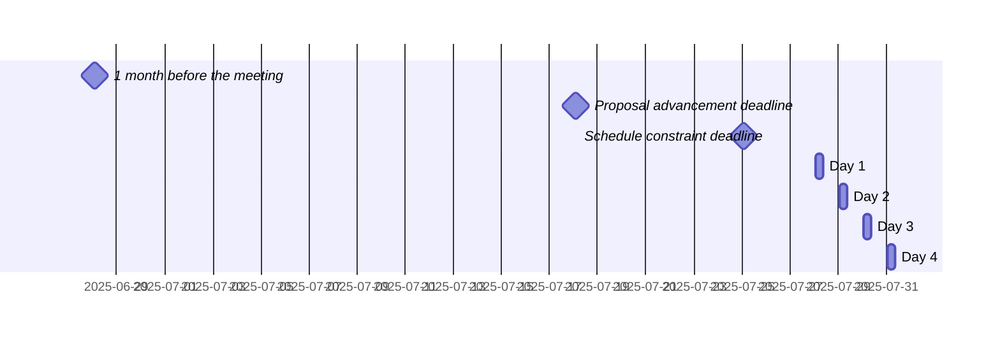

 <!-- markdownlint-disable-line MD041 -->

# Agenda for the 109th meeting of Ecma TC39

- **Host**: Remote
- **Dates and times**:
  - 10:00 to 15:00 PDT (America/Los_Angeles) on 28 July 2025
  - 10:00 to 15:00 PDT (America/Los_Angeles) on 29 July 2025
  - 10:00 to 15:00 PDT (America/Los_Angeles) on 30 July 2025
  - 10:00 to 15:00 PDT (America/Los_Angeles) on 31 July 2025
- **Location**: Remote
- **Attendee information**: <!-- TBD -->
- **Total duration of scheduled discussions**: 



For meeting times in your timezone, visit [Temporal docs](https://tc39.es/proposal-temporal/docs/) and run the code below in the devtools console.

```js
Temporal.ZonedDateTime.from('2025-07-28T10:00[America/Los_Angeles]')
  .withTimeZone(Temporal.Now.timeZoneId()) // your time zone
  .toLocaleString()
```

Background:

- Allen Wirfs-Brock's [paper on standards committee participation for new attendees](http://wirfs-brock.com/allen/files/papers/standpats-asianplop2016.pdf)
- TC39's documentation on [How to participate in meetings](https://github.com/tc39/how-we-work/blob/HEAD/how-to-participate-in-meetings.md)

## Agenda topic rules

Deadline for advancement eligibility: [July 18th 10:00 PDT](https://www.timeanddate.com/countdown/generic?p0=1440&iso=20250718T18&msg=TC39%20Submission%20deadline)

- <sub>Note: this time is selected to be precisely 10 days prior to the start of the meeting</sub>

1. Proposals not looking to advance may be added at any time; if after the deadline, please always use a pull request so that members are notified of changes. Note: an unmerged PR counts as “added” for the purposes of this requirement.
1. Proposals seeking feedback at stage 0 must be added (and noted as such) prior to the deadline, or else delegates may object to advancement solely on the basis of missing the deadline.
    1. Such proposals *should* include supporting materials when possible.
1. Proposals looking to advance to stage 1 must be added (and noted as such) prior to the deadline, or else delegates may object to advancement solely on the basis of missing the deadline.
    1. Such proposals *must* link to a proposal repository and they *should* link to supporting materials when possible.
1. Proposals looking to advance to stages 2, 2.7, 3, or 4, as well as other normative changes to the standard or proposals in stage 3 or later looking to achieve consensus, must be added (and noted as such) *along with links to the supporting materials* prior to the deadline, or else delegates may withhold consensus for advancement solely on the basis of missing the deadline.
    1. If the supporting materials change substantially after the deadline, delegates may withhold consensus for advancement, based on the committee’s judgment.
    1. For urgent normative changes, the committee is expected to be more forgiving of a missed deadline, since there is generally less material to review than in a stage advancement.
    1. Proposals looking to advance to stage 4 *must* link to a pull request into [the spec](https://github.com/tc39/ecma262), since the [process](https://tc39.github.io/process-document/) requires one.
1. Proposal-based agenda items should be sorted primarily by stage (descending), secondarily by timebox (ascending), and finally by insertion date.

Supporting materials includes slides, a link to the proposal repository, a link to spec text, etc.; essentially, anything you are planning to present to the committee, or that would be useful for delegates to review.

## Agenda key

When applicable, use these emoji as a prefix to the agenda item topic.

| Emoji | Meaning                                                              |
| :---: | :---                                                                 |
|  ❄️    | hard schedule constraints apply to this agenda item (e.g. presenter) |
|  🔒   | schedule constraints apply to this agenda item                       |
|  ⌛️   | late addition for stage advancement and/or schedule prioritization   |
|  🔁   | continuation of a previous agenda item                               |

## Agenda items

1. Opening, welcome and roll call (Chair)
    1. Opening of the meeting
    1. TC39 follows its [Code of Conduct](https://tc39.github.io/code-of-conduct/)
    1. Introduction of attendees
    1. Host facilities, local logistics
    1. Quick recap of meeting IPR policy
    1. Overview of communication tools
    1. Reminder to review Github Delegate teams (Jordan Harband)
    1. [TC39 stenography support and legal disclaimer](https://github.com/tc39/Reflector/blob/main/transcriptions.md)
1. Find volunteers for note taking
1. Adoption of the agenda
1. Approval of the minutes from last meeting
1. Next meeting host and logistics
1. Secretary's Report (15m, Samina Husain)
1. Project Editors’ Reports
    1. [ECMA262](https://github.com/tc39/ecma262) Status Updates (15m)
    1. [ECMA402](https://github.com/tc39/ecma402) Status Updates (15m)
    1. [ECMA404](https://www.ecma-international.org/publications/standards/Ecma-404.htm) Status Updates (15m)
    1. [Test262](https://github.com/tc39/test262) Status Updates (15m)
1. Task Group Reports
    <!-- 1. TG2: Internationalization (5m) - in practice, this is covered via the ECMA-402 project editors' report -->
    1. TG3: Security (5m)
    1. TG4: Source Maps (5m)
    1. TG5: Experiments in Programming Language Standardization (5m)
1. Updates from the [CoC Committee](https://tc39.es/code-of-conduct/#code-of-conduct-committee) (5m)
1. [Web compatibility issues](https://github.com/tc39/ecma262/issues?utf8=✓&q=is%3Aopen+label%3A%22web+reality%22+is%3Aissue) / [Needs Consensus PRs](https://github.com/tc39/ecma262/pulls?q=is%3Apr+is%3Aopen+label%3A%22needs+consensus%22)

    | timebox | topic | presenter |
    |:-------:|-------|-----------|
    | 10m     | Missing name property for %IntlSegmentsPrototype%[%Symbol.iterator%] ([tc39/ecma402#1015](https://github.com/tc39/ecma402/pull/1015)) | Ujjwal Sharma or Richard Gibson |
    | 20m     | Spec/implementations divergence on module evaluation promises settlement order ([tc39/ecma262/#3589](https://github.com/tc39/ecma262/issues/3589), [slides](https://docs.google.com/presentation/d/1g3JGIazNuA1Tuk35t_M4qxJD8ajNsYiTcWpTrXQnEns)) | Nicolò Ribaudo |
    | 20m     | F.p.toString incompat for builtin accessors (https://github.com/tc39/ecma262/issues/3652) | Keith Miller |

1. Overflow from previous meeting

    | timebox | topic | presenter |
    |:-------:|-------|-----------|

1. Short (≤30m) Timeboxed Discussions

    | timebox | topic | presenter |
    |:-------:|-------|-----------|
    | 30m     | *How* to make thenables safer? [(in-progress-slides)](https://docs.google.com/presentation/d/1_RCnI7dzyA1COgi_Ib7GkmHioV1nVSEMmZvy0bvJ8Kk/edit?usp=sharing) | Matthew Gaudet (Mozilla) |
    | 30m     | Freezing the Array Iterator ([slides](https://docs.google.com/presentation/d/1SHqRJDEujG3OVOxs9c3CEnXpHdkzyVrz9qUFyaXrQWA/)) | Kevin Gibbons |
    | 30m     | Proposed code of conduct addition: "write your own comments" ([issue](https://github.com/tc39/code-of-conduct/issues/62) / [slides](https://docs.google.com/presentation/d/1bGwg5fEYa_q65-o-qr8nbSZs5FuDHEeawTf_xGVwk4w/)) | Kevin Gibbons |

1. Proposals

    | stage | timebox | topic | presenter |
    |:-----:|:-------:|-------|-----------|
    | 3 | 5m | [Math.sumPrecise](https://github.com/tc39/proposal-math-sum/) for Stage 4 ([spec PR](https://github.com/tc39/ecma262/pull/3654)) | Kevin Gibbons |
    | 3 | 5m | [Uint8Array base64+hex](https://github.com/tc39/proposal-arraybuffer-base64) for Stage 4 ([spec PR](https://github.com/tc39/ecma262/pull/3655)) | Kevin Gibbons |
    | 3 | 20m | [Temporal](https://github.com/tc39/proposal-temporal) normative PR ([slides](https://docs.google.com/presentation/d/1xaHux5EvR9zXQWnnr0r76ffCdDejmy383XrkrmSPStk/edit?slide=id.p#slide=id.p)) | Nicolò Ribaudo |
    | 2.7 | 15m | [Iterator Sequencing](https://github.com/tc39/proposal-iterator-sequencing) for Stage 3 ([slides](https://docs.google.com/presentation/d/12zBgwq7qSpf-GXySU0q6t46vTdYAyFxaKW26J8D5IiE)) | Michael Ficarra |
    | 2.7 | 15m | [Upsert](https://github.com/tc39/proposal-upsert) for Stage 3 ([slides](https://docs.google.com/presentation/d/15J_tgYqrh-aPat0klS78BcDVGYJ88HOCC_SBsYkR4QY/)) | Daniel Minor |
    | 2.7 | 30m | [Immutable ArrayBuffer](https://github.com/tc39/proposal-immutable-arraybuffer) for stage 3 (slides TBD) | Richard Gibson, Peter Hoddie |
    | 2.7 | 30m | [Non-extensible Applies to Private](https://github.com/tc39/proposal-nonextensible-applies-to-private) for stage 3 (slides TBD) | Mark Miller |
    | 2 | 30m | [Iterator Chunking](https://github.com/tc39/proposal-iterator-chunking) for Stage 2.7 ([slides](https://docs.google.com/presentation/d/17qDtY-2Qawt7SeKoY7Rezea-A_hAuwhx2QHJ9MCZ7as)) | Michael Ficarra |
    | 2 | 45m | [Intl Era and Month Code](https://github.com/tc39/proposal-intl-era-monthcode) for Stage 2.7 ([slides](https://docs.google.com/presentation/d/1dAbacNvhPL_iUJKZNPDbQVyfg8a6-OHUuh2OiftMu1A/edit?slide=id.p#slide=id.p)) | Ujjwal Sharma |
    | 2 | 5m | [AsyncContext](https://github.com/tc39/proposal-async-context/) update | Andreu Botella |
    | 1 | 30m | [Error.captureStackTrace](https://github.com/tc39/proposal-error-capturestacktrace) for Stage 2 ([slides](https://docs.google.com/presentation/d/1RGNDcJee_6N2II0SeGyMVglvjhJbuqDX02LLzBqyCWI/)) | Daniel Minor |
    | 1 | 30m | [Keep trailing zeros in Intl.NumberFormat and Intl.PluralRules](https://github.com/eemeli/proposal-intl-keep-trailing-zeros) for Stage 2 or 2.7 (slides TBD) | Eemeli Aro |
    | 0 | 30m | [Import Buffer](https://github.com/styfle/proposal-import-buffer) for Stage 1 ([slides](https://proposal-import-buffer.vercel.app)) | Steven Salat |
    | 1 | 30m | [Object.propertyCount](https://github.com/tc39/proposal-object-property-count) for Stage 2 (slides TBD) | @BridgeAR |
    | 0 | 30m | [Array.isSparse](https://github.com/BridgeAR/isSparse) for Stage 1 (slides TBD) | @BridgeAR |
    | 0 | 30m | [Array.getNonIndexStringProperties](https://github.com/BridgeAR/array-get-non-index-string-properties) for Stage 1 (slides TBD) | @BridgeAR |
    | 0 | 30m | [Object.getOwnPropertySymbols options](https://github.com/BridgeAR/object-get-own-property-symbols-options) for Stage 1 (slides TBD) | @BridgeAR |
    | 0 | 30m | [Module Import Hook](https://github.com/endojs/proposal-import-hook) for Stage 1 (slides TBD) | Kris Kowal |
    | 0 | 30m | [new Global](https://github.com/endojs/proposal-new-global) for Stage 1 (slides TBD) | Zbyszek Tenerowicz |

1. Longer or open-ended discussions

    | timebox | topic | presenter |
    |:-------:|-------|-----------|

1. Overflow from timeboxed agenda items (in insertion order)

    | topic | presenter |
    |-------|-----------|

1. Incubation call chartering (15m on the last day)

1. Other business
    1. Thank host
1. Adjournment

### Schedule constraints

*Schedule constraints should be supplied here as soon as possible, and **at least three days** before the meeting begins so that the Chairs can take them into account when preparing the schedule.*

<!-- DO NOT PUT YOUR CONSTRAINTS HERE! Put them in one of the next sections: either "Normal Constraints" or "Late-breaking Schedule Constraints" -->

<!-- Be specific! Provide a full name, date and time range that they will or will not be available, and which sessions they are trying to prioritize. Satisfaction not guaranteed, but more information is useful. Conflicting constraints honored on a first-come, first served basis. -->

#### Normal Constraints

<!-- Constraints supplied more than three days before the meeting should go here -->
- Eemeli will be available on Day 1 from 11:30 onwards, and will not be available on Day 4.
  He would prefer to present on keep-trailing-zeros before any other numerics presentations.
- Ruben will be able to attend one day only. It is not important which one.
  He would prefer to present all four proposals in one go, especially, since they are all somewhat related to each other.

#### Late-breaking Schedule Constraints

<!-- Constraints supplied less than three days before the meeting should go here -->
