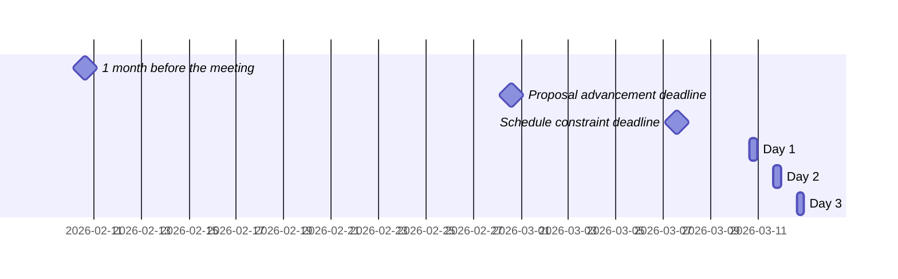

 <!-- markdownlint-disable-line MD041 -->

# Agenda for the 113th meeting of Ecma TC39

- **Host**: TBD
- **Dates and times**:
  - 10:00 to 17:00 EDT (America/New_York, UTC-5) on 10 March 2026
  - 10:00 to 17:00 EDT (America/New_York, UTC-5) on 11 March 2026
  - 10:00 to 16:00 EDT (America/New_York, UTC-5) on 12 March 2026
- **Location**: New York, NY
- **Attendee information**: https://github.com/tc39/Reflector/issues/573
- **Total duration of scheduled discussions**: 



For meeting times in your timezone, visit [Temporal docs](https://tc39.es/proposal-temporal/docs/) and run the code below in the devtools console.

```js
Temporal.ZonedDateTime.from('2026-03-10T10:00[America/New_York]')
  .withTimeZone(Temporal.Now.timeZoneId()) // your time zone
  .toLocaleString();
```

Background:

- Allen Wirfs-Brock's [paper on standards committee participation for new attendees](http://wirfs-brock.com/allen/files/papers/standpats-asianplop2016.pdf)
- TC39's documentation on [How to participate in meetings](https://github.com/tc39/how-we-work/blob/HEAD/how-to-participate-in-meetings.md)

## Agenda topic rules

Deadline for advancement eligibility: [February 28th 10:00 America/New_York](https://www.timeanddate.com/countdown/generic?p0=179&iso=20260228T10&msg=TC39%20Submission%20deadline)

- <sub>Note: this time is selected to be precisely 10 days prior to the start of the meeting</sub>

1. Proposals not looking to advance may be added at any time; if after the deadline, please always use a pull request so that members are notified of changes. Note: an unmerged PR counts as “added” for the purposes of this requirement.
1. Proposals seeking feedback at stage 0 must be added (and noted as such) prior to the deadline, or else delegates may object to advancement solely on the basis of missing the deadline.
    1. Such proposals *should* include supporting materials when possible.
1. Proposals looking to advance to stage 1 must be added (and noted as such) prior to the deadline, or else delegates may object to advancement solely on the basis of missing the deadline.
    1. Such proposals *must* link to a proposal repository and they *should* link to supporting materials when possible.
1. Proposals looking to advance to stages 2, 2.7, 3, or 4, as well as other normative changes to the standard or proposals in stage 3 or later looking to achieve consensus, must be added (and noted as such) *along with links to the supporting materials* prior to the deadline, or else delegates may withhold consensus for advancement solely on the basis of missing the deadline.
    1. If the supporting materials change substantially after the deadline, delegates may withhold consensus for advancement, based on the committee’s judgment.
    1. For urgent normative changes, the committee is expected to be more forgiving of a missed deadline, since there is generally less material to review than in a stage advancement.
    1. Proposals looking to advance to stage 4 *must* link to a pull request into [the spec](https://github.com/tc39/ecma262), since the [process](https://tc39.github.io/process-document/) requires one.
1. Proposal-based agenda items should be sorted primarily by stage (descending), secondarily by timebox (ascending), and finally by insertion date.

Supporting materials includes slides, a link to the proposal repository, a link to spec text, etc.; essentially, anything you are planning to present to the committee, or that would be useful for delegates to review.

## Agenda key

When applicable, use these emoji as a prefix to the agenda item topic.

| Emoji | Meaning                                                              |
| :---: | :---                                                                 |
|  ❄️    | hard schedule constraints apply to this agenda item (e.g. presenter) |
|  🔒   | schedule constraints apply to this agenda item                       |
|  ⌛️   | late addition for stage advancement and/or schedule prioritization   |
|  🔁   | continuation of a previous agenda item                               |

## Agenda items

1. Opening, welcome and roll call (Chair, 10m)
    1. Opening of the meeting
    1. TC39 follows its [Code of Conduct](https://tc39.github.io/code-of-conduct/)
    1. Introduction of attendees
    1. Host facilities, local logistics
    1. Quick recap of meeting IPR policy
    1. Overview of communication tools
    1. Reminder to review Github Delegate teams (Jordan Harband)
    1. [TC39 stenography support and legal disclaimer](https://github.com/tc39/Reflector/blob/main/transcriptions.md)
1. Find volunteers for note taking
1. Adoption of the agenda
1. Approval of the minutes from last meeting
1. Next meeting host and logistics
1. Secretary's Report (15m, Samina Husain)
1. Election of the 2026 Chair Group, Convenors, and [Editors](https://github.com/tc39/Reflector/issues/574) (15m, Aki Rose Braun, Samina Husain)
1. Project Editors’ Reports
    1. [ECMA262](https://github.com/tc39/ecma262) Status Updates (5m)
    1. [ECMA402](https://github.com/tc39/ecma402) Status Updates (5m)
    1. [ECMA404](https://www.ecma-international.org/publications/standards/Ecma-404.htm) Status Updates (1m)
    1. [Test262](https://github.com/tc39/test262) Status Updates (5m)
1. Task Group Reports
    <!-- 1. TG2: Internationalization (5m) - in practice, this is covered via the ECMA-402 project editors' report -->
    1. TG3: Security (1m)
    1. TG4: Source Maps (5m)
    1. TG5: Experiments in Programming Language Standardization (5m)
1. Updates from the [CoC Committee](https://tc39.es/code-of-conduct/#code-of-conduct-committee) (1m)
1. [Web compatibility issues](https://github.com/tc39/ecma262/issues?utf8=✓&q=is%3Aopen+label%3A%22web+reality%22+is%3Aissue) / [Needs Consensus PRs](https://github.com/tc39/ecma262/pulls?q=is%3Apr+is%3Aopen+label%3A%22needs+consensus%22)

    | timebox | topic | presenter |
    |:-------:|-------|-----------|

1. Overflow from previous meeting

    | timebox | topic | presenter |
    |:-------:|-------|-----------|

1. Short (≤30m) Timeboxed Discussions

    | timebox | topic | presenter |
    |:-------:|-------|-----------|
    | 30m | [Abort Protocol Discussion](https://github.com/jasnell/discussion-abort-protocol) | James M Snell |

1. Proposals

    | stage | timebox | topic | presenter |
    |:-----:|:-------:|-------|-----------|
    | 3 | 15m | [import defer](https://github.com/tc39/proposal-defer-import-eval/) interaction with [tc39/ecma262#3715](https://github.com/tc39/ecma262/pull/3715), and normative PR *Shield dynamic import defer against Promise.prototype monkey patch* ([PR#77](https://github.com/tc39/proposal-defer-import-eval/pull/77), [PR#79](https://github.com/tc39/proposal-defer-import-eval/pull/79), [slides](https://docs.google.com/presentation/d/1T1M7X-cS_ODKOl6Nsq-_YmHusVoD6bPtAS_MHzxzgTw)) | Nicolò Ribaudo |
    | 3 | 90m | [Temporal](https://github.com/tc39/proposal-temporal) for Stage 4 (materials TBA) | Philip Chimento |
    | 2.7 | 60m | Update on [ESM Phase Imports](https://github.com/tc39/proposal-esm-phase-imports) (slides to follow) | Guy Bedford |
    | 2 |  5m | Withdraw [Dynamic Import Host Adjustment](https://github.com/tc39/proposal-dynamic-import-host-adjustment) | Steve Hicks |
    | 2 | 45m | [Import Text](https://github.com/tc39/proposal-import-text) for Stage 2.7 or 3 ([slides](https://docs.google.com/presentation/d/1mbkpHjqihHBx6rp07Snb8uB8XevJk7jz2xPSyQppSjE/edit?usp=sharing), [PR #10](https://github.com/tc39/proposal-import-text/pull/10)) | Eemeli Aro |
    | 1 | 20m | [Intl Energy Units](https://github.com/johanrd/proposal-intl-energy-units) Stage 1 Update ([slides](https://docs.google.com/presentation/d/1iwknifQLEIA42KIoveoNLrRZlhEitZQ_JTKADP20rMA/edit?slide=id.p#slide=id.p)) | Shane F Carr |
    | 1 | 30m | [TypedArray concat](https://github.com/tc39/proposal-typedarray-concat) for Stage 2 (slides TBD) | James M Snell |
    | 1 | 30m | [TypedArray find within](https://github.com/tc39/proposal-typedarray-findwithin) for Stage 2 (slides TBD) | James M Snell |
    | 1 | 30m | [Intl Unit Protocol](https://github.com/sffc/proposal-intl-unit-protocol) for Stage 2 ([slides](https://docs.google.com/presentation/d/1ECuRD0MU6-Z5DzBJaOi5W3u7f2kf_PZYZU9cXjg5Ock/edit?slide=id.p#slide=id.p)) | Shane F Carr |
    | 1 | 60m | [Thenable Curtailment](https://github.com/tc39/proposal-thenable-curtailment) for Stage 2 (Slides TBD) | Matthew Gaudet |
    | 0 | 30m | [Iterator Includes](https://github.com/michaelficarra/proposal-iterator-includes) for Stage 1, 2, or 2.7 ([slides](https://docs.google.com/presentation/d/1a-1RQayP-tcJd2VAhFGoiL_dRT8gD8_qrp__qSgC1A4)) | Michael Ficarra |
    | 0 | 30m | [Error code property](https://github.com/jasnell/proposal-error-code-property) for Stage 1, 2, or 2.7 (slides TBD) | James M Snell |

1. Longer or open-ended discussions

    | timebox | topic | presenter |
    |:-------:|-------|-----------|
    | 90m | Tree-shakeable methods ([slides](https://docs.google.com/presentation/d/1zy10o54PMuh2c9Liz6RH5R3bnBpe-3-sy0uEXbACzjQ/edit?usp=sharing)) | Evan B Winslow |

1. Overflow from timeboxed agenda items (in insertion order)

    | topic | presenter |
    |-------|-----------|

<!-- 1. Incubation call chartering (15m on the last day) -->

1. Other business
    1. Thank host
1. Adjournment

### Schedule constraints

*Schedule constraints should be supplied here as soon as possible, and **at least three days** before the meeting begins so that the Chairs can take them into account when preparing the schedule.*

<!-- DO NOT PUT YOUR CONSTRAINTS HERE! Put them in one of the next sections: either "Normal Constraints" or "Late-breaking Schedule Constraints" -->

<!-- Be specific! Provide a full name, date and time range that they will or will not be available, and which sessions they are trying to prioritize. Satisfaction not guaranteed, but more information is useful. Conflicting constraints honored on a first-come, first served basis. -->

#### Normal Constraints

<!-- Constraints supplied more than three days before the meeting should go here -->

- Philip Chimento: Temporal not on Tuesday. Preferably on Wednesday.
- Jesse Alama (JMN): Cannot attend first half of March 11th, and not at all on March 12th. If possible, please schedule any numerics-related presentations (e.g., Amount) for Tuesday or second half of Wednesday. Since I'm likely not presenting myself, this is a violable preference, not a hard constraint.
- Nicolò Ribaudo: Cannot attend the first two hours on Thursday. I only *need* to be available for my topics, but I'm also interested in the thenables and abort protocol topics

#### Late-breaking Schedule Constraints

<!-- Constraints supplied less than three days before the meeting should go here -->
