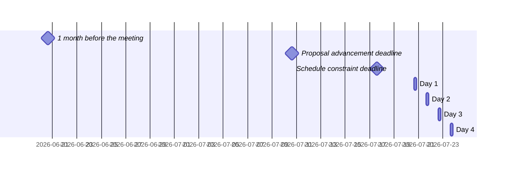

 <!-- markdownlint-disable-line MD041 -->

# Agenda for the 115th meeting of Ecma TC39

- **Host**: Remote
- **Dates and times**:
  - 10:00 to 15:00 ACT (America/Eirunepe) on 2026-07-20
  - 10:00 to 15:00 ACT (America/Eirunepe) on 2026-07-21
  - 10:00 to 15:00 ACT (America/Eirunepe) on 2026-07-22
  - 10:00 to 15:00 ACT (America/Eirunepe) on 2026-07-23
- **Location**: Remote
- **Attendee information**: https://github.com/tc39/Reflector/issues/584
- **Total duration of scheduled discussions**: 
  - **Estimated meeting capacity**: 16:00h <sub>This is an <em>estimate</em>: if you want to add a topic to the agenda, do not let this number stop you!</sub>



For meeting times in your timezone, visit [Temporal docs](https://tc39.es/proposal-temporal/docs/) and run the code below in the devtools console.

```js
// UPDATE THE START DATE AND IANA TIMEZONE NAME BELOW AND DELETE THIS COMMENT
Temporal.ZonedDateTime.from('2026-07-20T10:00[America/Eirunepe]')
  .withTimeZone(Temporal.Now.timeZoneId()) // your time zone
  .toLocaleString();
```

Background:

- Allen Wirfs-Brock's [paper on standards committee participation for new attendees](http://wirfs-brock.com/allen/files/papers/standpats-asianplop2016.pdf)
- TC39's documentation on [How to participate in meetings](https://github.com/tc39/how-we-work/blob/HEAD/how-to-participate-in-meetings.md)

## Agenda topic rules

Deadline for advancement eligibility: [July 10th 2026 10:00 America/Eirunepe](https://www.timeanddate.com/countdown/generic?p0=1440&iso=20260710T15&msg=TC39%20Submission%20deadline)

- <sub>Note: this time is selected to be precisely 10 days prior to the start of the meeting</sub>

1. Proposals not looking to advance may be added at any time; if after the deadline, please always use a pull request so that members are notified of changes. Note: an unmerged PR counts as “added” for the purposes of this requirement.
1. Proposals seeking feedback at stage 0 must be added (and noted as such) prior to the deadline, or else delegates may object to advancement solely on the basis of missing the deadline.
    1. Such proposals *should* include supporting materials when possible.
1. Proposals looking to advance to stage 1 must be added (and noted as such) prior to the deadline, or else delegates may object to advancement solely on the basis of missing the deadline.
    1. Such proposals *must* link to a proposal repository and they *should* link to supporting materials when possible.
1. Proposals looking to advance to stages 2, 2.7, 3, or 4, as well as other normative changes to the standard or proposals in stage 3 or later looking to achieve consensus, must be added (and noted as such) *along with links to the supporting materials* prior to the deadline, or else delegates may withhold consensus for advancement solely on the basis of missing the deadline.
    1. If the supporting materials change substantially after the deadline, delegates may withhold consensus for advancement, based on the committee’s judgment.
    1. For urgent normative changes, the committee is expected to be more forgiving of a missed deadline, since there is generally less material to review than in a stage advancement.
    1. Proposals looking to advance to stage 4 *must* link to a pull request into [the spec](https://github.com/tc39/ecma262), since the [process](https://tc39.github.io/process-document/) requires one.
1. Proposal-based agenda items should be sorted primarily by stage (descending), secondarily by timebox (ascending), and finally by insertion date.

Supporting materials includes slides, a link to the proposal repository, a link to spec text, etc.; essentially, anything you are planning to present to the committee, or that would be useful for delegates to review.

## Agenda key

When applicable, use these emoji as a prefix to the agenda item topic.

| Emoji | Meaning                                                              |
| :---: | :---                                                                 |
|  ❄️    | hard schedule constraints apply to this agenda item (e.g. presenter) |
|  🔒   | schedule constraints apply to this agenda item                       |
|  ⌛️   | late addition for stage advancement and/or schedule prioritization   |
|  🔁   | continuation of a previous agenda item                               |

## Agenda items

1. Opening, welcome and roll call (Chair, 10m)
    1. Opening of the meeting
    1. TC39 follows its [Code of Conduct](https://tc39.github.io/code-of-conduct/)
    1. Introduction of attendees
    1. Host facilities, local logistics
    1. Quick recap of meeting IPR policy
    1. Overview of communication tools
    1. Reminder to review Github Delegate teams (Jordan Harband)
    1. [TC39 stenography support and legal disclaimer](https://github.com/tc39/Reflector/blob/main/transcriptions.md)
1. Find volunteers for note taking
1. Adoption of the agenda
1. Approval of the minutes from last meeting
1. Next meeting host and logistics
1. Secretary's Report (15m, Samina Husain)
1. Project Editors’ Reports
    1. [ECMA262](https://github.com/tc39/ecma262) Status Updates (5m)
    1. [ECMA402](https://github.com/tc39/ecma402) Status Updates (5m)
    1. [ECMA404](https://www.ecma-international.org/publications/standards/Ecma-404.htm) Status Updates (1m)
    1. [Test262](https://github.com/tc39/test262) Status Updates (5m)
1. Task Group Reports
    <!-- 1. TG2: Internationalization (5m) - in practice, this is covered via the ECMA-402 project editors' report -->
    1. TG3: Security (1m)
    1. TG4: Source Maps (5m)
    1. TG5: Experiments in Programming Language Standardization (5m)
1. Updates from the [CoC Committee](https://tc39.es/code-of-conduct/#code-of-conduct-committee) (1m)
1. [Web compatibility issues](https://github.com/tc39/ecma262/issues?utf8=✓&q=is%3Aopen+label%3A%22web+reality%22+is%3Aissue) / [Needs Consensus PRs](https://github.com/tc39/ecma262/pulls?q=is%3Apr+is%3Aopen+label%3A%22needs+consensus%22)

    | timebox | topic | presenter |
    |:-------:|-------|-----------|
    | 20m | Needs-consensus PR: make Promise.try use PromiseResolve in non-error case ([#3883](https://github.com/tc39/ecma262/pull/3883), [tests](https://github.com/tc39/test262/pull/5072), [slides](https://docs.google.com/presentation/d/1x7FdF7RdGBCI6TVHrbtBMAw5tvXI2mMDthqcd5n8rc4/edit?usp=sharing)) | Kevin Gibbons |
    | 5m | Needs-consensus PR: require hosts that provide a custom global object to allow initializing ECMA-262 built-ins on it (https://github.com/tc39/ecma262/pull/3728) | Nicolò Ribaudo |
    | 2m | [TG2] Needs-consensus PR: [Normative: Take language subtag into account in locale hour cycle lookup](https://github.com/tc39/ecma402/pull/1086) | Shane Carr |
    | 2m | [TG2] Needs-consensus PR: [Normative: Allow `Locale.p.getNumberingSystems` to return >1 item](https://github.com/tc39/ecma402/pull/1074) | Shane Carr |
    | 2m | [TG2] Needs-consensus PR: [Normative: Don't fall back to default locale in `Locale.p.getCollations()`](https://github.com/tc39/ecma402/pull/1072) | Shane Carr |
    | 2m | [TG2] Needs-consensus PR: [Normative: Call `RegionPreference` in `WeekInfoOfLocale`](https://github.com/tc39/ecma402/pull/1051) | Shane Carr |

1. Overflow from previous meeting

    | timebox | topic | presenter |
    |:-------:|-------|-----------|

1. Short (≤30m) Timeboxed Discussions

    | timebox | topic | presenter |
    |:-------:|-------|-----------|
    | 30m | machine-readable source of truth for proposal info, delegate info, and maybe more ([repo](https://github.com/michaelficarra/tc39-data), [demo](https://michaelficarra.github.io/tc39-data/), [slides](https://docs.google.com/presentation/d/1aP1LDkspsVlvjYRDN63bTIjzP6rz1m6eHbZooGNu9QA)) | Michael Ficarra |

1. Proposals

    | stage | timebox | topic | presenter |
    |:-----:|:-------:|-------|-----------|
    | 3 | 30m | [Import Defer](https://tc39.es/proposal-defer-import-eval/) Stage 3 updates ([slides](https://docs.google.com/presentation/d/1pH5SCZRJaN-HFeOn0WZ9KD64vvunPZdxhyYuMMHZLC8)) | Caio Lima &  Nicolò Ribaudo |
    | 2.7 | 30m | [Await Dictionary](https://github.com/tc39/proposal-await-dictionary) for Stage 3 ([spec](https://tc39.es/proposal-await-dictionary/), tests: [1](https://github.com/tc39/test262/tree/main/test/built-ins/Promise/allKeyed), [2](https://github.com/tc39/test262/tree/main/test/built-ins/Promise/allSettledKeyed)) | Ashley Claymore |
    | 2 | 30m | [Thenable Curtailment](https://github.com/tc39/proposal-thenable-curtailment) for 2.7 ([slides (in progress)](https://docs.google.com/presentation/d/1kHq_UqMHGGT8ena8yMlJKgHmohDVqxJvV4hiCB12HtU/view?)) | Matthew Gaudet |
    | 2 | 30m | [JSON.parseImmutable](https://github.com/tc39/proposal-json-parseimmutable) stage 2 update | Ashley Claymore & Peter Klecha |
    | 2 | 45m | [Duration units in Amount and Intl Sequence Units](https://github.com/tc39/proposal-intl-sequence-units/issues/8) ([slides](https://tc39.es/proposal-intl-sequence-units/slides/time-units.html)) | Shane F Carr |
    | 2 | 60m | [Async iterator helpers](https://github.com/tc39/proposal-async-iterator-helpers) open questions ([slides](https://docs.google.com/presentation/d/17_mL3guxupbKWKr1EbDdML9K9kPTqElbf9xgoZZDBh0/edit)) and [demo](https://bakkot.github.io/async-iterator-helpers-implementation/) | Kevin Gibbons |
    | 1 | 20m | [Error code property](https://github.com/tc39/proposal-error-code-property) for Stage 2 or 2.7 | James Snell |
    | 1 | 20m | [Private declarations](https://github.com/tc39/proposal-private-declarations) update ([slides](https://docs.google.com/presentation/d/1Cmk_vpi6yID9dJjZqqSfKMhvYmO2xXGRakAxcXvHq4s/edit?usp=sharing)) | Kevin Gibbons |
    | 1 | 30m | [Declarations in Conditionals](https://github.com/tc39/proposal-Declarations-in-Conditionals) for Stage 2 or 2.7 ([spec](https://tc39.es/proposal-Declarations-in-Conditionals/)) | Devin Rousso |
    | 1 | 30m | [Decimal](https://github.com/tc39/proposal-decimal/) stage 1 update ([slides](https://notes.igalia.com/p/tc39-2026-07-decimal/)) | Caio Lima & Jesse Alama |
    | 0 | 15m | [Map take](https://github.com/dcrousso/proposal-Map-take) for stage 1, 2, or 2.7 | Devin Rousso |
    | 0 | 30m | [Fused Multiply-Add](https://github.com/waldemarhorwat/fma) for Stage 1 or 2 ([slides](https://docs.google.com/presentation/d/e/2PACX-1vQ5JHSa97CYNyS42bllFQ0CX-ctDlDSPTMG7kKAEflEwqrl3K-dqOlvdFyIq1eDp2k-BoNG2yfueHpQ/pub?start=false&loop=false&delayms=3000)) | Waldemar Horwat |
    | 0 | 30m | [Intl.DateTimeFormat Alignment With Other Standards](https://github.com/eemeli/proposal-intl-datetime-alignment) for Stage 1 ([slides](https://docs.google.com/presentation/d/1JAb9AFDNdgrcDMS24iTZPTqi5p3uzHLr8JDZOI-5CYM/edit)) | Eemeli Aro |
    | 0 | 45m | [Linear Matching](https://github.com/michaelficarra/proposal-linear-matching) for Stage 1 ([slides](https://docs.google.com/presentation/d/19Y18Lt165cSwqLI7K7aeA6IbSp9FOC1psrC2_MfaLs4)) | Michael Ficarra |

1. Longer or open-ended discussions

    | timebox | topic | presenter |
    |:-------:|-------|-----------|

1. Overflow from timeboxed agenda items (in insertion order)

    | topic | presenter |
    |-------|-----------|

<!-- 1. Incubation call chartering (15m on the last day) -->

1. Other business
    1. Thank host
1. Adjournment

### Schedule constraints

*Schedule constraints should be supplied here as soon as possible, and **at least three days** before the meeting begins so that the Chairs can take them into account when preparing the schedule.*

<!-- DO NOT PUT YOUR CONSTRAINTS HERE! Put them in one of the next sections: either "Normal Constraints" or "Late-breaking Schedule Constraints" -->

<!-- Be specific! Provide a full name, date and time range that they will or will not be available, and which sessions they are trying to prioritize. Satisfaction not guaranteed, but more information is useful. Conflicting constraints honored on a first-come, first served basis. -->

#### Normal Constraints

<!-- Constraints supplied more than three days before the meeting should go here -->
- James M Snell (JSL) unavailable between 10am-11am on Monday July 20th

#### Late-breaking Schedule Constraints

<!-- Constraints supplied less than three days before the meeting should go here -->
