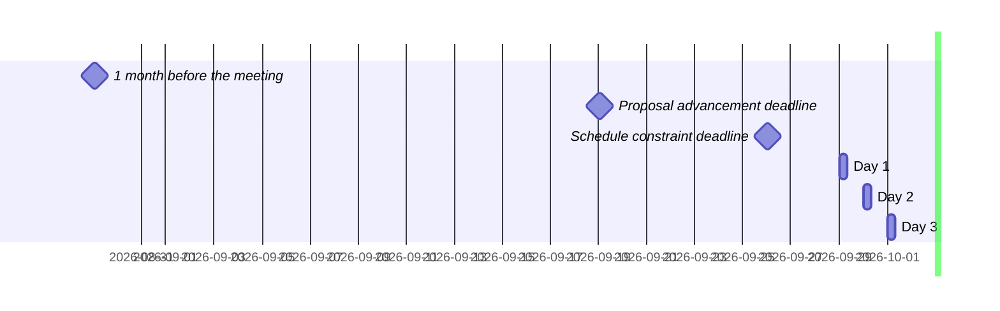

 <!-- markdownlint-disable-line MD041 -->

# Agenda for the 116th meeting of Ecma TC39

- **Host**: Sony
- **Dates and times**:
  - 10:00 to 17:00 JST (Asia/Tokyo) on Tuesday 29 September 2026
  - 10:00 to 17:00 JST (Asia/Tokyo) on Wednesday 30 September 2026
  - 10:00 to 16:00 JST (Asia/Tokyo) on Thursday 1 October 2026
- **Location**: Tokyo, Japan
- **Attendee information**: https://github.com/tc39/Reflector/issues/586
- **Total duration of scheduled discussions**:  <!-- UPDATE YYYY AND MM -->
  - **Estimated meeting capacity**: 15:00h <sub>This is an <em>estimate</em>: if you want to add a topic to the agenda, do not let this number stop you!</sub>



For meeting times in your timezone, visit [Temporal docs](https://tc39.es/proposal-temporal/docs/) and run the code below in the devtools console.

```js
Temporal.ZonedDateTime.from('2026-09-29T10:00[Asia/Tokyo]')
  .withTimeZone(Temporal.Now.timeZoneId()) // your time zone
  .toLocaleString();
```

Background:

- Allen Wirfs-Brock's [paper on standards committee participation for new attendees](http://wirfs-brock.com/allen/files/papers/standpats-asianplop2016.pdf)
- TC39's documentation on [How to participate in meetings](https://github.com/tc39/how-we-work/blob/HEAD/how-to-participate-in-meetings.md)

## Agenda topic rules

Deadline for advancement eligibility: [September 19th 10:00 Asia/Tokyo](https://www.timeanddate.com/countdown/winter?iso=20260919T10&p0=248&msg=111th+TC39+Plenary+in+Tokyo&font=sanserif&csz=1)

- <sub>Note: this time is selected to be precisely 10 days prior to the start of the meeting</sub>

1. Proposals not looking to advance may be added at any time; if after the deadline, please always use a pull request so that members are notified of changes. Note: an unmerged PR counts as “added” for the purposes of this requirement.
1. Proposals seeking feedback at stage 0 must be added (and noted as such) prior to the deadline, or else delegates may object to advancement solely on the basis of missing the deadline.
    1. Such proposals *should* include supporting materials when possible.
1. Proposals looking to advance to stage 1 must be added (and noted as such) prior to the deadline, or else delegates may object to advancement solely on the basis of missing the deadline.
    1. Such proposals *must* link to a proposal repository and they *should* link to supporting materials when possible.
1. Proposals looking to advance to stages 2, 2.7, 3, or 4, as well as other normative changes to the standard or proposals in stage 3 or later looking to achieve consensus, must be added (and noted as such) *along with links to the supporting materials* prior to the deadline, or else delegates may withhold consensus for advancement solely on the basis of missing the deadline.
    1. If the supporting materials change substantially after the deadline, delegates may withhold consensus for advancement, based on the committee’s judgment.
    1. For urgent normative changes, the committee is expected to be more forgiving of a missed deadline, since there is generally less material to review than in a stage advancement.
    1. Proposals looking to advance to stage 4 *must* link to a pull request into [the spec](https://github.com/tc39/ecma262), since the [process](https://tc39.github.io/process-document/) requires one.
1. Proposal-based agenda items should be sorted primarily by stage (descending), secondarily by timebox (ascending), and finally by insertion date.

Supporting materials includes slides, a link to the proposal repository, a link to spec text, etc.; essentially, anything you are planning to present to the committee, or that would be useful for delegates to review.

## Agenda key

When applicable, use these emoji as a prefix to the agenda item topic.

| Emoji | Meaning                                                              |
| :---: | :---                                                                 |
|  ❄️    | hard schedule constraints apply to this agenda item (e.g. presenter) |
|  🔒   | schedule constraints apply to this agenda item                       |
|  ⌛️   | late addition for stage advancement and/or schedule prioritization   |
|  🔁   | continuation of a previous agenda item                               |

## Agenda items

1. Opening, welcome and roll call (Chair, 10m)
    1. Opening of the meeting
    1. TC39 follows its [Code of Conduct](https://tc39.github.io/code-of-conduct/)
    1. Introduction of attendees
    1. Host facilities, local logistics
    1. Quick recap of meeting IPR policy
    1. Overview of communication tools
    1. Reminder to review Github Delegate teams (Jordan Harband)
    1. [TC39 stenography support and legal disclaimer](https://github.com/tc39/Reflector/blob/main/transcriptions.md)
1. Find volunteers for note taking
1. Adoption of the agenda
1. Approval of the minutes from last meeting
1. Next meeting host and logistics
1. Secretary's Report (15m, Samina Husain)
1. Addition of Eemeli Aro as an ECMA-402 editor (10m, Richard Gibson)
1. Project Editors’ Reports
    1. [ECMA262](https://github.com/tc39/ecma262) Status Updates ([slides](https://docs.google.com/presentation/d/1x2UCdQjVo-5GEwE77Ww8SD5HYCpfsAp5QuYf4n1yC-0)) (5m)
    1. [ECMA402](https://github.com/tc39/ecma402) Status Updates (5m)
    1. [ECMA404](https://www.ecma-international.org/publications/standards/Ecma-404.htm) Status Updates (see [tc39/Reflector#587](https://github.com/tc39/Reflector/issues/587)) (10m)
    1. [Test262](https://github.com/tc39/test262) Status Updates (5m)
1. Task Group Reports
    <!-- 1. TG2: Internationalization (5m) - in practice, this is covered via the ECMA-402 project editors' report -->
    1. TG3: Security (1m)
    1. TG4: Source Maps (5m)
    1. TG5: Experiments in Programming Language Standardization (5m)
1. Updates from the [CoC Committee](https://tc39.es/code-of-conduct/#code-of-conduct-committee) (1m)
1. [Web compatibility issues](https://github.com/tc39/ecma262/issues?utf8=✓&q=is%3Aopen+label%3A%22web+reality%22+is%3Aissue) / [Needs Consensus PRs](https://github.com/tc39/ecma262/pulls?q=is%3Apr+is%3Aopen+label%3A%22needs+consensus%22)

    | timebox | topic | presenter |
    |:-------:|-------|-----------|
    | 20m | Needs-consensus PR: make DataView.prototype.{byteLength,byteOffset} not throw when backed by detached buffer ([PR](https://github.com/tc39/ecma262/pull/3972), [slides](https://docs.google.com/presentation/d/1SgGitTmE7BtyJ2Vnqkv5CUOhhACuHFlIOe85qNXLBYI/edit?usp=sharing)) | Kevin Gibbons |
    | 20m | [Normative: Update RevalidateAtomicAccess to account for all bytes of a TypedArray element](https://github.com/tc39/ecma262/pull/3926) | Richard Gibson |
    | 30m | [Normative: Make tail-call optimization normative-optional](https://github.com/tc39/ecma262/pull/3957) | Richard Gibson |
    | 45m | [Normative: Change KeptAlive semantics to strongify particular WeakRefs](https://github.com/tc39/ecma262/pull/3974) | Keith Miller |
    | 2m | [TG2] Needs-consensus PR: [Allow `Locale.p.getNumberingSystems` to return > 1 items](https://github.com/tc39/ecma402/pull/1074) | Jesse Alama |
    | 2m | [TG2] Needs-consensus PR: [Determine `getWeekInfo().firstDay` using First Day Overrides](https://github.com/tc39/ecma402/pull/1097) | Jesse Alama |
    | 2m | [TG2] Needs-consensus PR: [Define `%TypedArray%.prototype.toLocaleString`](https://github.com/tc39/ecma402/pull/1095) | Jesse Alama |

1. Overflow from previous meeting

    | timebox | topic | presenter |
    |:-------:|-------|-----------|

1. Short (≤30m) Timeboxed Discussions

    | timebox | topic | presenter |
    |:-------:|-------|-----------|
    | 10m | update on TC39 data repo and proposal status tracking | Michael Ficarra, Jordan Harband |
    | 15m | seeking consensus for update to AI policy for assistive technology - [PR](https://github.com/tc39/how-we-work/pull/174) | Chris de Almeida |

1. Proposals

    | stage | timebox | topic | presenter |
    |:-----:|:-------:|-------|-----------|
    | 3 | 5m | [Iterator Join](https://github.com/tc39/proposal-iterator-join) for Stage 4 ([PR](https://github.com/tc39/ecma262/pull/3948), [implementation status](https://github.com/tc39/proposal-iterator-join/issues/7)) | Kevin Gibbons |
    | 3 | 7m | [Iterator Includes](https://github.com/tc39/proposal-iterator-includes) for Stage 4 ([PR](https://github.com/tc39/ecma262/pull/3969), [slides](https://docs.google.com/presentation/d/1uLfWHUpPjWWjPQTaiuhIAT9WdFO7pAroKlY049rkGJA)) | Michael Ficarra |
    | 3 | 8m | [Iterator Chunking](https://github.com/tc39/proposal-iterator-chunking) for Stage 4 ([PR](https://github.com/tc39/ecma262/pull/3970), [slides](https://docs.google.com/presentation/d/1K9Hf1w5tYEbU2o5CUZPj1m0JtBmKcugVf-_OfGW1jms)) | Michael Ficarra |
    | 3 | 9m | [Dynamic Code Brand Checks](https://github.com/tc39/proposal-dynamic-code-brand-checks) for Stage 4 ([PR](https://github.com/tc39/ecma262/pull/3294), [slides](https://docs.google.com/presentation/d/1oYsZ-6CLpTv971nXYgWIgFGIz5VAyz11pUxsCpO0mXY/)) | Nicolò Ribaudo |
    | 3 | 30m | [Disallow Adding New Private Fields to Non-extensible Objects](https://github.com/tc39/proposal-nonextensible-applies-to-private) [PR#12](https://github.com/tc39/proposal-nonextensible-applies-to-private/pull/12) | Olivier Flückiger |
    | 2.7 | 30m | [ESM Phase Imports](https://github.com/tc39/proposal-esm-phase-imports) normative PRs for [Module source identity](https://github.com/tc39/proposal-esm-phase-imports/pull/63) and [Non-injective source imports](https://github.com/tc39/proposal-esm-phase-imports/pull/63) | Guy Bedford |
    | 2.7 | 30m | [Thenable Curtailment](https://github.com/tc39/proposal-thenable-curtailment) for Stage 3 ([Test 262 PR](https://github.com/tc39/test262/pull/5123), [Slides](https://docs.google.com/presentation/d/1Gs5s56q0znHMX5mfup4PslGUrnM3_ngeaUqXy3STt2A/edit?usp=sharing)) | Matthew Gaudet |
    | 2 | 20m | [Intl Sequence Units](https://github.com/tc39/proposal-intl-sequence-units) Stage 2 Update (slides TBD) | Shane F Carr |
    | 2 | 20m | [Intl Unit Protocol](https://github.com/tc39/proposal-intl-unit-protocol) Stage 2 Update (slides TBD) | Shane F Carr |
    | 2 | 30m | [Amount](https://github.com/tc39/proposal-amount/) Stage 2 Update ([slides](https://notes.igalia.com/p/tc39-2026-09-amount/)) | Jesse Alama |
    | 2 | 30m | [export defer](https://github.com/tc39/proposal-deferred-reexports/) for Stage 2.7 ([slides](https://docs.google.com/presentation/d/1M_5zKVnyzCrPdxFnMSQrOwiyRX-p9t0Nt8S4Osx55a0/)) | Nicolò Ribaudo & Caio Lima |
    | 2 | 30m | [JSON.parse Options](https://github.com/tc39/proposal-json-parseimmutable) for Stage 2.7 ([slides])(https://docs.google.com/presentation/d/1xNMjd3p8wo4NqtuBCOu-We_lFWX0SWI36721xmjlSHQ) | Peter Klecha & Ashley Claymore |
    | 2 | 120m | [Async iterators](https://github.com/tc39/proposal-async-iterator-helpers): [the whole proposal](https://docs.google.com/presentation/d/19xEFe4rHPDxpX_ai7dXrYY3wNtgwcsaKV25PwZiml54/edit?usp=sharing) + [open questions](https://docs.google.com/presentation/d/1FfYbAJ2pElLQPqn32ZvgtuTQzEWU_79ZjKMs--k1CMY/edit?usp=sharing) (timebox can be split) | Kevin Gibbons |
    | 1 | 20m | [Include default in `export *`](https://github.com/tc39/proposal-export-star-default) for Stage 2 & 2.7 ([slides](https://docs.google.com/presentation/d/1jHiOZQCgz626zVcrIPqYjp_PtmGfPXqMkyVZMHZA4HU/)) | Nicolò Ribaudo |
    | 1 | 30m | [Bigint from exponential](https://github.com/tc39/proposal-bigint-from-exponential) for Stage 2 | Richard Gibson |
    | 1 | 30m | [Private declarations](https://github.com/tc39/proposal-private-declarations) for Stage 2 ([slides](https://docs.google.com/presentation/d/1uM_nsM0eVc7G0_Pse2JsC5Xn1uBhgfRAgYYOlBY8v8s/)) | Kevin Gibbons |
    | 1 | 60m | [Composites](https://github.com/tc39/proposal-composites) for Stage 2 ([draft spec](https://tc39.es/proposal-composites/), [slides](https://docs.google.com/presentation/d/1lN-LdmUQ9Nh6bF-5uuuuAQhHtDBTmI9xfYyj6TH_8F4/)) | Ashley Claymore |
    | 0 | 28m | [Pulling in AbortController](https://github.com/bakkot/structured-concurrency-for-js) for Stage 1 or something ([slides](https://docs.google.com/presentation/d/1iRpJ3ADc50ZRUsmwYi9Yp3qjixBq3wMWWx_jw7cFleU/edit?usp=sharing)) | Kevin Gibbons |

1. Longer or open-ended discussions

    | timebox | topic | presenter |
    |:-------:|-------|-----------|
    | 60m     | reworking Cover and Supplemental Grammars ([slides](https://docs.google.com/presentation/d/1cB-HL6pob5tHBJu4BCEv57d4BdJDP1oXO62Eb-ALVHo/edit?usp=sharing), [draft spec](https://mikbar-uib.github.io/ecma262/spec/cover-grammar/)) | Mikhail Barash |
    | 60m     | It's about the agenda deadline ([slides](https://docs.google.com/presentation/d/1uA690pDEj3NplfGnACwKAhek3bcECChVcQELcu_nF_Q/)) | Chris de Almeida |
    | 60m     | It's about the AI policy (wrestling with ambiguities, expectations, intent, and permissible usage) | Chris de Almeida |

1. Overflow from timeboxed agenda items (in insertion order)

    | topic | presenter |
    |-------|-----------|

<!-- 1. Incubation call chartering (15m on the last day) -->

1. Other business
    1. Thank host
1. Adjournment

### Schedule constraints

*Schedule constraints should be supplied here as soon as possible, and **at least three days** before the meeting begins so that the Chairs can take them into account when preparing the schedule.*

<!-- DO NOT PUT YOUR CONSTRAINTS HERE! Put them in one of the next sections: either "Normal Constraints" or "Late-breaking Schedule Constraints" -->

<!-- Be specific! Provide a full name, date and time range that they will or will not be available, and which sessions they are trying to prioritize. Satisfaction not guaranteed, but more information is useful. Conflicting constraints honored on a first-come, first served basis. -->

#### Normal Constraints

<!-- Constraints supplied more than three days before the meeting should go here -->

- Kevin Gibbons (KG) would prefer not to present after 15:00 JST.
- Nicolò Ribaudo would prefer *Include default in `export *`* to precede *export defer*. I *very strongly prefer* to present after 15:00; if I need to present earlier I need to know the day before (and still, even if before 15:00 later is better).
- Guy Bedford is only available to present from 10am - 12pm JST on the last day. He will also be attending from in-flight WiFi during the first day except for the last hour.
- Matthew Gaudet is only available to present from 10am to 12pm JST, after the first day.

#### Late-breaking Schedule Constraints

<!-- Constraints supplied less than three days before the meeting should go here -->
