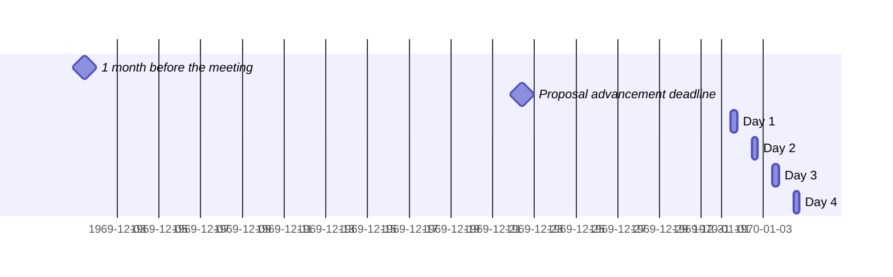

 <!-- markdownlint-disable-line MD041 -->

# Agenda for the TBD meeting of Ecma TC39

- **Host**: TBD
- **Dates and times**:
  - 10:00 to 17:00 TZ (IANA name here, e.g. Asia/Tokyo) on TBD
  - 10:00 to 17:00 TZ (IANA name here, e.g. Asia/Tokyo) on TBD
  - 10:00 to 16:00 TZ (IANA name here, e.g. Asia/Tokyo) on TBD
- **Location**: CITY, COUNTRY
- **Attendee information**: LINK TO REFLECTOR



For meeting times in your timezone, visit [Temporal docs](https://tc39.es/proposal-temporal/docs/) and run the code below in the devtools console.

```js
// UPDATE THE START DATE AND IANA TIMEZONE NAME BELOW AND DELETE THIS COMMENT
Temporal.ZonedDateTime.from('2021-10-25T10:00[Europe/London]')
  .withTimeZone(Temporal.Now.timeZoneId()) // your time zone
  .toLocaleString()
```

Background:

- Allen Wirfs-Brock's [paper on standards committee participation for new attendees](http://wirfs-brock.com/allen/files/papers/standpats-asianplop2016.pdf)
- TC39's documentation on [How to participate in meetings](https://github.com/tc39/how-we-work/blob/HEAD/how-to-participate-in-meetings.md)

## Agenda topic rules

Deadline for advancement eligibility: [**CALCULATE TIME HERE**](https://www.timeanddate.com/countdown/generic?p0=1440&iso=20000101T18&msg=TC39%20Submission%20deadline)

- <sub>Note: this time is selected to be precisely 10 days prior to the start of the meeting</sub>

1. Proposals not looking to advance may be added at any time; if after the deadline, please always use a pull request so that members are notified of changes. Note: an unmerged PR counts as “added” for the purposes of this requirement.
1. Proposals seeking feedback at stage 0 must be added (and noted as such) prior to the deadline, or else delegates may object to advancement solely on the basis of missing the deadline.
    1. Such proposals *should* include supporting materials when possible.
1. Proposals looking to advance to stage 1 must be added (and noted as such) prior to the deadline, or else delegates may object to advancement solely on the basis of missing the deadline.
    1. Such proposals *must* link to a proposal repository and they *should* link to supporting materials when possible.
1. Proposals looking to advance to stages 2, 3, or 4, as well as other normative changes to the standard or proposals in stage 3 or later looking to achieve consensus, must be added (and noted as such) *along with links to the supporting materials* prior to the deadline, or else delegates may withhold consensus for advancement solely on the basis of missing the deadline.
    1. If the supporting materials change substantially after the deadline, delegates may withhold consensus for advancement, based on the committee’s judgment.
    1. For urgent normative changes, the committee is expected to be more forgiving of a missed deadline, since there is generally less material to review than in a stage advancement.
    1. Proposals looking to advance to stage 4 *must* link to a pull request into [the spec](https://github.com/tc39/ecma262), since the [process](https://tc39.github.io/process-document/) requires one.
1. Proposal-based agenda items should be sorted primarily by stage (descending), secondarily by timebox (ascending), and finally by insertion date.

Supporting materials includes slides, a link to the proposal repository, a link to spec text, etc.; essentially, anything you are planning to present to the committee, or that would be useful for delegates to review.

## Agenda key

When applicable, use these emoji as a prefix to the agenda item topic.

| Emoji | Meaning                                                              |
| :---: | :---                                                                 |
|  ❄️   | hard schedule constraints apply to this agenda item (e.g. presenter) |
|  🔒   | schedule constraints apply to this agenda item                       |
|  ⌛️   | late addition for stage advancement and/or schedule prioritization   |
|  🔁   | continuation of a previous agenda item                               |

## Agenda items

1. Opening, welcome and roll call (Chair)
    1. Opening of the meeting
    1. TC39 follows its [Code of Conduct](https://tc39.github.io/code-of-conduct/)
    1. Introduction of attendees
    1. Host facilities, local logistics
    1. Quick recap of meeting IPR policy
    1. Overview of communication tools
    1. Reminder to review Github Delegate teams (Jordan Harband)
1. Find volunteers for note taking
    <details>
        <summary>Note about meeting transcriptions</summary>
        A detailed transcript of the meeting is being prepared and will be eventually posted on GitHub. You may edit this at any time during the meeting in Google Docs for accuracy, including deleting comments which you do not wish to appear. You may also request corrections or deletions after the fact, by editing the Google Doc (in the first two weeks after the TC39 meeting) or subsequently making a PR in the notes repository or contacting the TC39 chairs.
    </details>
1. Adoption of the agenda
1. Approval of the minutes from last meeting
1. Next meeting host and logistics
1. Secretary's Report (15m, Samina Husain)
1. Project Editors’ Reports
    1. [ECMA262](https://github.com/tc39/ecma262) Status Updates (15m)
    1. [ECMA402](https://github.com/tc39/ecma402) Status Updates (15m)
    1. [ECMA404](https://www.ecma-international.org/publications/standards/Ecma-404.htm) Status Updates (15m)
    1. [Test262](https://github.com/tc39/test262) Status Updates (15m)
1. Task Group Reports
    <!-- 1. TG2: Internationalization (5m) - in practice, this is covered via the ECMA-402 project editors' report -->
    1. TG3: Security (5m)
    1. TG4: Source Maps (5m)
1. Updates from the [CoC Committee](https://tc39.es/code-of-conduct/#code-of-conduct-committee) (5m)
1. [Web compatibility issues](https://github.com/tc39/ecma262/issues?utf8=✓&q=is%3Aopen+label%3A%22web+reality%22+is%3Aissue) / [Needs Consensus PRs](https://github.com/tc39/ecma262/pulls?q=is%3Apr+is%3Aopen+label%3A%22needs+consensus%22)

    | ✓ | timebox | topic | presenter |
    |:-:|:-------:|-------|-----------|

1. Overflow from previous meeting

    | ✓ | timebox | topic | presenter |
    |:-:|:-------:|-------|-----------|

1. Incubation call chartering (15m on the last day)

1. Short (&le;30m) Timeboxed Discussions

    | ✓ | timebox | topic | presenter |
    |:-:|:-------:|-------|-----------|

1. Proposals

    ✓ represents an agenda item which has been presented, and does not indicate stage advancement

    | ✓ | stage | timebox | topic | presenter |
    |:-:|:-----:|:-------:|-------|-----------|

1. Longer or open-ended discussions

    | ✓ | timebox | topic | presenter |
    |:-:|:-------:|-------|-----------|

1. Overflow from timeboxed agenda items (in insertion order)

    | ✓ | topic | presenter |
    |:-:|-------|-----------|

1. Other business
    1. Thank host
1. Adjournment

### Schedule constraints

*Schedule constraints should be supplied here **48 hours** before the meeting begins so that the Chairs can take them into account when preparing the schedule.*

<!-- Be specific! Provide a full name, date and time range that they will or will not be available, and which sessions they are trying to prioritize. Satisfaction not guaranteed, but more information is useful. Conflicting constraints honored on a first-come, first served basis. -->

#### Normal Constraints

<!-- Constraints supplied more than 48 hours before the meeting should go here -->

#### Late-breaking Schedule Constraints

<!-- Constraints supplied less than 48 hours before the meeting should go here -->

## Dates and locations of future meetings

TBD (Copy the table from the previous agenda)
